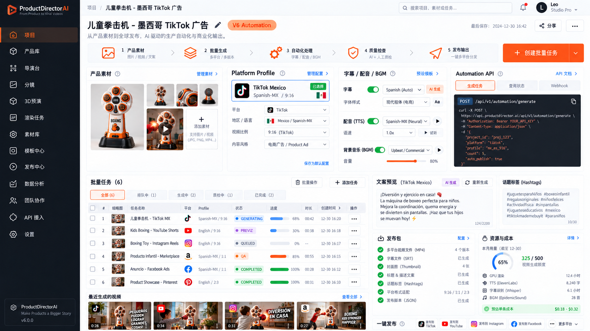

# ProductDirectorAI：V1–V6 完整产品与开发规划书

文档版本：1.0 · 编写日期：2026-09-10  
使用对象：产品负责人、开发者、执行开发任务的 Codex SOL 5.6  
文档性质：待实施的产品规格、工程合同和阶段施工单；不代表软件已经实现或测试通过。

> 执行原则：一次只实施一个已授权版本。每期完成代码、迁移、测试、真实链路验证和验收报告后停止。下一期由产品负责人明确解锁。不能把模拟输出、静态界面、被跳过的测试或降级预览当作完整验收通过。

## 目录

1. [规划依据、路线与边界](#1-规划依据路线与边界)
2. [产品体验与参考图映射](#2-产品体验与参考图映射)
3. [统一技术架构](#3-统一技术架构)
4. [共用数据合同](#4-共用数据合同)
5. [API、状态机与执行可靠性](#5-api状态机与执行可靠性)
6. [Provider 与本地云端策略](#6-provider-与本地云端策略)
7. [V1：产品素材与 3D 导演 MVP](#7-v1产品素材与-3d-导演-mvp)
8. [V2：AI Director 与 Provider Manager](#8-v2ai-director-与-provider-manager)
9. [V3：产品保真与重建校验](#9-v3产品保真与重建校验)
10. [V4：真人交互与接触规划](#10-v4真人交互与接触规划)
11. [V5：参考视频分析与重新演绎](#11-v5参考视频分析与重新演绎)
12. [V6：批量自动化生产与发布](#12-v6批量自动化生产与发布)
13. [工程目录与依赖管理](#13-工程目录与依赖管理)
14. [测试资产、质量门与验收报告](#14-测试资产质量门与验收报告)
15. [Codex 执行协议和首条指令](#15-codex-执行协议和首条指令)
16. [接口与数据示例](#16-接口与数据示例)
17. [风险、决策与需求追踪](#17-风险决策与需求追踪)
18. [官方资料与实施时复核](#18-官方资料与实施时复核)

---

## 1. 规划依据、路线与边界

### 1.1 已确认的产品共识

本规划根据《早安问候交流》中最近明确的路线、产品图片入口补充，以及用户上传的 V6 Automation UI 参考图编写。原对话更早存在版本编号交叉和架构建议变化，本文件以最近共识为准，统一为下表；后续施工不得重新采用旧编号。

| 阶段 | 产品目标 | 必须交付的主链路 | 本期主要新增能力 |
| --- | --- | --- | --- |
| V1 | 产品素材与 3D 导演 MVP | 产品素材 → 三镜头计划 → Blender 预演 → MP4 | 素材入口、产品库、导演台、分镜、任务与基础导出 |
| V2 | AI Director / Provider | 一句话 → 可校验 DirectorPlan → 选择执行能力 → 可恢复任务 | 本地/远程 LLM、ComfyUI、MiniMax、Provider 管理、重建适配试验 |
| V3 | 产品保真 | 锁定产品版本 → 多通道渲染 → 背景/人物分层 → 合成与 QA | Strict Fidelity、多视图重建校验、可见区域与不确定性管理 |
| V4 | 真人交互 | 人物与产品锚点 → 接触预演 → 人物合成 → 交互审核 | 人体 Proxy、动作模板、接触/遮挡/时序、真人感镜头 |
| V5 | 参考视频重新演绎 | 参考视频 → 镜头语言分析 → 可编辑计划 → 用本产品重新拍摄 | 切镜、节奏、运镜推断、置信度、参考对照 |
| V6 | 生产与发布自动化 | Profile → 批量变体 → 音视频后期 → QA → 发布包 → 发布 | Platform Profile、字幕/TTS/BGM、Automation API、批次、成本与发布 |

原先的 V0 技术验证收纳为 V1 内部的 P0 前置门，不新增第七个产品版本。先通过 P0，再做 V1 完整界面。

### 1.2 产品定位

ProductDirectorAI 是独立的产品视频导演软件。用户上传产品素材，描述想拍的场景，确认分镜，获得可追踪来源的产品视频与发布材料。主要目标用户是电商商家、产品视频制作人员和批量运营人员。

核心分工固定：

- Director Core：把用户意图组织成版本化的镜头计划。
- Blender：提供产品几何、相机、动画、可控渲染与合成依据。
- Product Fidelity Engine：决定哪些像素和结构必须来自受信任产品资产。
- ComfyUI：执行经过批准、固定版本的 AI 视觉工作流。
- MiniMax：可替换的视频/其他能力 Provider；不承担整个业务编排。
- Postproduction：字幕、配音、BGM、剪辑、封面和发布包。
- Automation Orchestrator：任务图、批次、预算、审查、发布和对账。

### 1.3 输入边界

入口从 V1 即命名为“产品素材”，包含：3D 模型、单张图片、多角度图片、尺寸/规格说明。GLB 为 V1 真实可渲染的标准格式；GLTF/OBJ/FBX 在有明确转换器和测试后逐项启用。

单张图不能证明背面、深度或被遮挡结构。界面展示“来源与待核实区域”，不使用未经校准的真实性百分比或简单星级来暗示质量保证。图片重建输出必须经过用户确认，才能成为正式产品版本。

V1 对仅有图片的用户提供素材整理、分镜与可明确识别的图片预演；真实 3D 运镜验收使用已确认 GLB。V2 提供重建 Provider 合同和一个已验证适配路径；V3 完成重建审核与保真生产闭环。不得在 V1 承诺单图自动生成高精度可用模型。

### 1.4 规划中的工程选择与待验证事项

以下是为了让执行者可以开工而作出的默认工程决策：React/TypeScript 前端、Python/FastAPI 后端、PostgreSQL 持久层、Python Worker、Blender、FFmpeg、本地文件/S3 兼容存储接口。若目标仓库已有合适技术栈，先评估复用，以 ADR 记录差异；不得为符合文档而大规模重写可用系统。

本文件没有目标产品仓库、硬件清单、生产账号或实际 API Key。因此以下事项在对应阶段现场验证：实际模型可用性与许可、最低硬件、GPU 性能、云服务商、账号发布权限、语言音色质量、各平台限制与价格。缺少它们不妨碍完成合同与模拟测试，但会阻止相关真实集成的退出门通过。

### 1.5 商业目标与范围控制

主场景为“儿童拳击机 · 墨西哥西语短视频”。这是贯穿版本的验收用例，不把产品类别、国家或平台写死在代码里。其他产品使用同一资产/镜头合同。

V1–V6 暂不包含：广告投放与扣费、自动购买云 GPU、平台账号注册、完整多人实时编辑、跨企业计费系统、训练通用视频模型、全功能 Blender 编辑器、通用剪辑软件、无授权下载第三方视频、承诺爆款或销售效果。参考图中的数据分析与团队协作在 V6 只提供本文件限定的用量数据和基础角色权限。

---

## 2. 产品体验与参考图映射

### 2.1 参考图



参考图表现为约 1672 × 941 的桌面工作台：深色左导航、浅色画布、橙色主要动作、密集但有层级的卡片。图中的项目名、Logo、缩略图、账号、时间、计数、品牌服务名、报价和额度是设计示例；真实产品不得硬编码成业务事实。

### 2.2 视觉基线

| 元素 | 默认规格 | 交互/实现要求 |
| --- | --- | --- |
| 左导航 | 展开宽 224px，折叠 64px；深色 #111820 | 当前项橙色标记、图标加文字；折叠有提示 |
| 主画布 | #F7F9FC；卡片 #FFFFFF | 卡片边框 #E6EBF2，圆角 8px，间距 16px |
| 主动作 | 橙色 #FF5A1F，悬停加深 | 每个工作区一个主要动作，危险操作不共用同一橙色样式 |
| 正文 | #172033；辅助文字 #64748B | 正文 14px，表格不低于 12px；中文字体系统回退 |
| 页标题 | 24–28px，项目名、编辑按钮、阶段标签 | 保存状态由服务器确认；显示本地时区，底层使用 UTC |
| 顶栏 | 面包屑、搜索、通知、账号 | 搜索当前授权范围；未实施功能隐藏 |
| 状态 | 蓝=执行，紫=预演，灰=排队，橙=质检，绿=完成，红=失败 | 同时显示文字/图标，颜色不是唯一信息 |
| 密度 | 8px 间距基础；表格行默认 48px | 允许切换舒适密度；首屏能看到关键任务与主动作 |

以上颜色是从参考图风格推导的设计 token，施工时需检查文字对比度；允许为可读性调整，不要求逐像素复刻。

### 2.3 固定导航与版本解锁

| 参考图导航 | 路由 | 初次可用 | 职责 |
| --- | --- | --- | --- |
| 项目 | `/projects`、`/projects/:id` | V1 | 项目概览；V6 演进为生产总控台 |
| 产品库 | `/products`、`/products/:id` | V1 | 产品实体、素材、版本、规格与可信度 |
| 导演台 | `/projects/:id/director` | V1 | 简单输入、计划生成、高级调整 |
| 分镜 | `/projects/:id/storyboard` | V1 | 镜头卡片、时间轴、确认与版本差异 |
| 3D 预演 | `/projects/:id/previz` | V1 | 浏览器模型检查、已渲染预演、相机参数 |
| 渲染任务 | `/jobs`、`/jobs/:id` | V1 | 真正的执行状态、日志、恢复、成果 |
| 素材库 | `/assets` | V1 | 所有原始/派生媒体；与“产品库”保持不同职责 |
| 模板中心 | `/templates` | V2 | 已批准的镜头/工作流模板；V6 增加 Profile 和后期模板 |
| 发布中心 | `/publishing` | V6 | 发布包、账号、发布状态与重试 |
| 数据分析 | `/usage` | V6 | 本系统生产用量、耗时、失败率、预算；平台成效仅在有官方授权接入后扩展 |
| 团队协作 | `/settings/members` | V6 | Owner/Editor/Reviewer/Publisher 基础权限 |
| API 接入 | `/settings/api` | V6 | Automation Key、Webhook 与接口文档 |
| 设置 | `/settings` | V1 | 存储、渲染节点；V2 起 Provider、凭证与路由 |

未解锁菜单默认隐藏；需要演示路线时可显示禁用项及预计版本说明。禁止可点击却没有有效结果的装饰按钮。

### 2.4 各期主屏演进

| 版本 | 顶部 | 中央主体 | 右侧检查器 | 主动作 |
| --- | --- | --- | --- | --- |
| V1 | 项目名、草稿/已保存 | 左产品素材，中 3D/图片预览，下三张 Shot 卡 | 输出比例、时长、运镜模板、渲染位置 | 生成预演 |
| V2 | 计划版本、Provider 可用摘要 | 自然语言输入、分镜卡与编辑 | 选用能力、路线解释、费用估计、降级提示 | 生成导演计划 / 执行已确认计划 |
| V3 | 产品版本、Strict 状态 | 产品资产审核和原始/合成对照 | Mask/Depth/Logo 区域、保真 QA、问题列表 | 运行保真检查 |
| V4 | 镜头/动作选择 | 3D 接触预演、人物轨迹、事件时间线 | 身高、锚点、接触时刻、遮挡与动作检查 | 生成互动镜头 |
| V5 | 参考版本、分析状态 | 左参考视频/切镜，右目标分镜；共用对齐时间线 | 置信度、复用维度、替换策略 | 分析参考 / 创建目标计划 |
| V6 | 项目与批次摘要、五步生产链 | 第一排素材/Profile/音频/API；第二排批次表与预览 | Caption、话题、发布包、资源成本 | 创建批量任务 / 发布选定成果 |

### 2.5 V6 参考图的精确信息架构

从上到下组织为：

1. 项目标题行：项目名、`V6 Automation` 标签、保存状态、分享入口、更多操作。分享仅在具备权限与明确范围时启用。
2. 五步概览：产品素材 → 批量生成 → 自动化处理 → 质量检查 → 发布输出。步骤显示“当前批次中多少个任务处于该步”，不能用一个活动箭头掩盖并行状态。
3. 配置行：产品素材缩略图网格；Platform Profile；字幕/配音/BGM；Automation API 三标签面板。
4. 生产行：左侧宽区为批量任务表和最近生成的视频；右侧为可编辑 Caption、话题标签、发布包清单、资源与成本。
5. 发布栏：只对当前选择的已通过审核成果生效；显示平台与账号数量，点击后展示一次汇总确认。

推荐 12 栅格：≥1440px 第一排 3/3/3/3；第二排任务区 7，右侧 5；1024–1439px 第一排两列、第二排上下；<1024px 单列、导航抽屉、任务表可横向滚动，批量操作固定在其所属区域。固定发布栏不得遮挡最后一行内容。

### 2.6 共用体验要求

- 简单模式只要求产品素材、场景描述和输出目标；高级参数折叠。
- 任一长任务提交后立即显示任务链接，刷新页面与退出浏览器不会丢任务。
- 每个请求区分加载、空内容、失败、无权限、需配置、成功；失败保留表单输入。
- 变更产品版本、分镜、Profile、文案后，界面明确标记已有成果“使用旧版本”；不覆盖成果。
- 所有预览与下载必须能打开真实文件；模拟数据只在 Demo 模式出现，并有持续可见标识。
- 所有按钮可键盘访问；对话框有焦点约束与返回；进度播报节流；缩略图有描述。
- 保存使用乐观并发版本号；多窗口冲突显示可比较差异，不静默覆盖。

---

## 3. 统一技术架构

### 3.1 部署组成

```text
浏览器工作台
    │ HTTPS / REST / SSE
    ▼
API + 应用服务 ── PostgreSQL（业务、任务、事件、账本、Outbox）
    │                    │
    │ Storage 接口       │ 租约领取/状态回报
    ▼                    ▼
本地文件或 S3 存储   本地 Worker / 云端 GPU Worker
                         │
                 Director Core / Provider Router
                         │
          Blender / ComfyUI / MiniMax / LLM / FFmpeg
                         │
                  Artifact + QA + 发布包
                         │
                 V6 发布连接器与 Webhook
```

V1 采用模块化单体 API 加独立 Worker，不要求微服务或 Kubernetes。使用 PostgreSQL 持久任务表与租约调度，在一个数据库内保证业务记录和入队事务一致。V6 仍可使用相同机制；只有实测吞吐不足时才用 ADR 引入消息中间件，禁止双队列同时充当真值。

### 3.2 默认工程栈

| 层 | 默认选择 | 约束 |
| --- | --- | --- |
| Web | React、TypeScript、Vite、路由、查询缓存 | UI 调 API；不直接读取本机路径或携带 Provider Key |
| 3D 浏览器预览 | Three.js / glTF 加载器 | 仅检查与预览；离线成片由 Blender 输出 |
| API | Python、FastAPI、Pydantic | REST 合同生成 OpenAPI；请求校验与领域规则分开 |
| 数据库 | PostgreSQL、SQLAlchemy、Alembic | V1 起统一数据库；JSONB 只存版本化复杂文档 |
| Worker | Python 进程、PostgreSQL 租约 | API 不同步执行长渲染；独立子进程、超时与取消 |
| 渲染 | 现场确认的 Blender 稳定/LTS 版本 | 版本、引擎、插件和设备写入 Manifest；云/本地尽可能一致 |
| 后期 | FFmpeg / ffprobe | 确认所用发行包编码与字体能力；记录版本和许可证 |
| 存储 | LocalStorageAdapter / S3StorageAdapter | 接口统一；数据库存对象键，不存永久公开链接 |
| 测试 | pytest、前端单元测试、Playwright | 真实外部测试独立标记；无 Key 时记 BLOCKED，不能当 PASS |
| 交付 | 锁文件、容器/原生启动脚本、迁移和运行手册 | 从干净环境复现；版本号由 P0 确认后固定 |

Windows 可运行浏览器、API 和原生 Blender Worker；PostgreSQL 可以使用现有服务或本地容器。Linux GPU 节点运行云 Worker。不要假设 Windows 上已存在 Docker、WSL、CUDA 或 Bash。

### 3.3 模块责任与依赖方向

| 模块 | 负责 | 不得承担 |
| --- | --- | --- |
| Product Asset Service | 产品、素材引用、规格、版本、来源 | 自动宣称产品真实度、直接调发布平台 |
| Director Core | 计划生成、Schema/语义校验、版本、镜头规则 | 模型厂商专属字段、执行任意 AI 返回的代码 |
| Camera Engine | 路径模板、构图、焦段、帧采样 | 自由解释自然语言并直接运行脚本 |
| Render Service | SceneSpec 编译、渲染通道、帧完整性 | 人机审核、平台账号管理 |
| Provider Manager | 能力清单、路由、凭证引用、调用生命周期 | 改写产品目标、静默降低保真约束 |
| Fidelity Engine | 保护区域、合成、质量报告 | 把完整 AI 成片标成 Strict |
| Interaction Planner | 锚点、人物 Proxy、动作事件 | 自动承诺任意人机交互可行 |
| Reference Analyzer | 时间段、推断、置信度、目标映射 | 把来源视频中的指令当开发/系统指令 |
| Postproduction | 时间线、音轨、字幕、封面、编码 | 上传到社交平台 |
| Orchestrator | DAG、状态、重试、成本限制、快照 | 保存裸 Key、直接写业务成功而不验证产物 |
| Publishing Service | 账号授权、平台能力、提交、对账 | 生成视频或开展广告投放 |

领域层只能依赖 Provider/Storage 的抽象接口；具体 SDK 放在 adapters。浏览器不依赖 SDK 返回结构。先有合同，再接适配器，再做 UI。

### 3.4 云端 Blender 的明确含义

“云端 Blender”是运行相同 Worker 与 Blender 程序的远程计算节点。它不是浏览器原生 Blender，也不默认存在一个通用官方 Blender 云 API。

V1 支持“已配置的远程节点”，不实现自动租卡。云 Worker 使用短期身份向控制面领取任务；控制面不得把任意脚本发给节点执行。节点只接收固定 Schema 的 RenderRequest，调用仓库内可信脚本，下载有权限的输入，上传成果，回报心跳。

云模式必须有节点可访问的 HTTPS 控制面与对象存储；不能把 `localhost` 或 Windows 盘符交给云节点。节点失联后保留租约与产物指纹，恢复策略见第 5 章。

### 3.5 可复现性与成本边界

每次 Run 冻结：产品版本、计划版本、模型/工作流版本、Profile 版本、种子、渲染设置、代码提交、依赖锁摘要、输入哈希和选用 Provider。种子只辅助复现，不保证不同 GPU/生成模型逐像素一致。

所有付费或上传调用在提交前产生 estimate 与 route snapshot。用户授权的预算与数据区域是硬约束。尚无报价的能力显示“费用未知”，不当作免费。

---

## 4. 共用数据合同

### 4.1 数据约定

- 主键使用 UUID；示例中的 `proj_demo` 等为可读示意，不直接作为生产 UUID 校验用例。
- 时间以 UTC ISO-8601 传输，数据库 `timestamptz`；时长以整数帧为视频真值，音频用 sample index/时间基。
- 金额用十进制定点数加 ISO 币种；API 用十进制字符串，不使用二进制浮点累计费用。
- 所有受权限约束的实体有 `workspace_id`；子表通过外键和服务校验保证同一工作区，不能只依赖前端过滤。
- 可变记录有 `revision`；版本实体发布后不可变；删除先软删除，引用中的资产禁止物理删除。
- 任一媒体有 SHA-256、字节数、MIME、来源、许可状态和对象键；不能只相信扩展名。
- 每个 JSON 文档带 `schema_version`；旧版本由显式迁移函数读取；未知主版本拒绝执行。

### 4.2 V1 基础实体

| 实体 | 核心字段 | 关系、约束 |
| --- | --- | --- |
| Workspace / Membership | id、name；user_id、role | V1 单工作区/Owner，V6 开放角色配置 |
| Project | name、description、active_product_version_id、current_plan_version_id、revision | 属于工作区；引用必须同一工作区 |
| Product | name、sku、category、specification_json、revision | 同一产品多个不可变 ProductVersion |
| ProductVersion | product_id、version_no、source_kind、model_asset_id、image_asset_ids、dimensions、unit、origin_transform、review_state | `product_id + version_no` 唯一；确认后不可原地改写 |
| Asset | kind、mime、size、sha256、storage_key、source_type、rights_status、metadata | kind 包括 image/model/video/audio/document/mask/depth |
| ProjectAsset | project_id、asset_id、role | 一个素材可被多个项目引用，引用不复制文件 |
| DirectorPlanVersion | project_id、version_no、schema_version、payload、validation_report、approval_state、approved_by | 与产品版本绑定；批准后只读 |
| Run | project_id、plan_version_id、run_kind、snapshot、status、parent_run_id | 一次明确生产意图；修改输入创建新 Run |
| Job | run_id、stage、status、progress、attempt_count、lease_owner、lease_expires_at、lease_epoch | 每个阶段执行单元，依赖 DAG |
| JobDependency | job_id、depends_on_job_id | 禁止环；所有依赖成功或合法降级后才能调度 |
| JobAttempt | job_id、attempt_no、execution_key、provider_operation_id、started_at、ended_at、error_code | 每次重试可审计；外部提交不确定必须单独记录 |
| Artifact | run_id、job_id、asset_id、role、manifest、validation_state | 先验证后可见；临时文件不能作为成果 |
| JobEvent | job_id、sequence、event_type、payload、created_at | 同一 Job 序号递增；用于 SSE 和历史恢复 |
| AuditEvent | actor、action、resource、before_hash、after_hash、request_id | V1 记录关键修改、确认、取消；日志脱敏 |

### 4.3 各期增量实体

| 阶段 | 实体 | 必须保存的字段 |
| --- | --- | --- |
| V2 | ProviderConfig | provider_type、location、base_url_ref、credential_ref、enabled、capability_revision |
| V2 | ProviderCapability | operation、input_types、output_types、limits、local_requirements、supports_cancel、idempotency_support、fidelity_constraints、verified_at |
| V2 | RoutingPolicy / RouteDecision | preference、fallback_allowed、region、budget、chosen_route、rejected_routes、reason |
| V2 | ReconstructionAttempt | input_asset_ids、provider_operation_id、result_model_id、uncertainty_regions、state |
| V3 | FidelityPolicy | mode、protected_regions、allowed_operations、threshold_set_version |
| V3 | ProductReview / QAReport | asset/plan/run 快照、checks、metrics、attachments、reviewer、decision |
| V4 | InteractionAnchor | product_version_id、name、position_m、normal、contact_radius_m、allowed_actions |
| V4 | CharacterSpec / MotionTemplate | source、rights_ref、height_m、proxy_asset_id；skeleton_version、motion_asset_id、limits |
| V4 | InteractionPlan | shot_id、actor_id、anchor_id、start_frame、contact_frame、end_frame、occlusion_policy |
| V5 | ReferenceAsset / ReferenceAnalysis | source_asset_id、rights_ref、analysis_version、segments、model_revision、confidence、warnings |
| V5 | ReferenceMapping | segment_id、target_shot_id、selected_dimensions、adaptations、review_state |
| V6 | PlatformProfileVersion | platform、region、locale、format、safe_area、copy_rules、audio_defaults、rules_verified_at |
| V6 | Batch / BatchItem | input_snapshot、variant_spec、dedupe_key、run_id、status、counts |
| V6 | Localization / AudioTrack / SubtitleTrack | locale、text_revision、voice_ref、license_ref、segments、alignment、gain、mix_version |
| V6 | PublishPackageVersion | artifact_refs、profile_snapshot、manifest_hash、qa_report_id、approval_id |
| V6 | ConnectedAccount / PublishJob | platform、account_ref、credential_ref、scopes；package_version_id、state、external_id、visibility |
| V6 | PublishApproval | actor、account_ids、package_hashes、visibility、scope、expiry、revoked_at |
| V6 | UsageEvent / CostEntry / BudgetReservation | operation_id、unit、quantity、estimate、actual、currency、rate_version、state |
| V6 | AutomationKey / WebhookEndpoint / OutboxEvent / DeliveryAttempt | scopes、hash；url、secret_ref；event_id、payload；attempt、response、next_retry_at |

增量实体仅在相应版本实现。V1 只预留稳定标识和扩展点，不创建全部未来业务表。

### 4.4 产品来源与确认状态

`source_kind = ORIGINAL_3D | MULTIVIEW_RECONSTRUCTION | SINGLE_IMAGE_RECONSTRUCTION | IMAGE_ONLY | MANUAL_MODEL`。

`review_state = DRAFT | NEEDS_REVIEW | APPROVED | REJECTED | SUPERSEDED`。

UI 展示来源类别、尺寸是否已核实、正侧背视图覆盖、材质/Logo 是否已核实、缺失区域与审核人。原始 3D 也可能存在尺寸或纹理错误，不能因格式是 GLB 就自动标 APPROVED。

`IMAGE_ONLY` 不具备真实环绕镜头能力；可执行 2D 平移/缩放或固定视图预演，必须通过 capability validation 限制镜头。重建前后版本保留关联，不替换原始图片。

### 4.5 DirectorPlan 合同

必须字段：`schema_version`、`product_version_id`、`intent`、`output`、`fidelity_mode`、`shots`。每个 Shot 必须有稳定 `id`、`duration_frames`、`camera`、`product_pose`、`scene`；V4 起允许 `actors` 和 `interactions`，V5 起允许 `reference_mapping`。

V1 计划约束：3 个 Shot，总时长 5–8 秒，固定帧率 24，默认 9:16，运镜枚举 `hero_orbit | dolly_in | side_track | static`。`hero_orbit` 仅用于具备已确认背面模型的资产。高级模式可调整模板参数，不能接受 Python、Shell 或任意表达式。

V1 的合同文件固定两种 9:16 输出：540×960 预演与 1080×1920 基础导出；其他比例由 V6 Profile 扩展。`fidelity_mode=STRICT` 在 V1/V2 表示请求中的保护约束，不是已通过 V3 的质量认证。界面直到真实 V3 保真检查通过前都不得显示“Strict 保真已验证”。

图片预演使用独立 `ImagePreviewSpec`：`schema_version`、`product_version_id`、`image_asset_id`、`duration_frames`、`output`、`motion=static|pan|zoom`、`start_crop`、`end_crop`；crop 采用 0–1 归一化矩形且始终在原图范围内。它通过确定性图片时间线/FFmpeg 出预演，Manifest 标 `preview_kind=IMAGE_2D`，不能执行 3D DirectorPlan 或满足 GLB 渲染验收。

V2 起扩展镜头数量与长度，但以模型能力、预算和版本策略共同约束。LLM 只产出结构化提案；服务端进行 JSON Schema 校验、资产权限校验、总帧数校验、镜头可行性校验与阶段能力校验。

坐标系：内部 Blender 世界空间为右手、Z 向上、单位米；产品规范正面朝 -Y，原点为底部中心；资产导入时保存原始到规范空间的变换。Three.js 显示层使用显式变换适配器，不假设导入坐标完全一致。相机参数用焦距 mm、传感器 mm、位置 m 与 target；由 Camera Engine 计算姿态。

输出尺寸、像素宽高比、帧率、色彩变换写入 RenderSpec。镜头时间使用半开区间 `[start_frame, end_frame)`，Blender 实际渲染范围由适配器转换，避免多一帧。

Camera Path 统一采用 `t=f/(duration_frames−1)`，默认 smoothstep 缓动。orbit 以产品世界原点为中心，`x=r×sin(angle)`、`y=−r×cos(angle)`、`z=height_m`，零角度位于产品正面；start/end angle 线性插值后应用缓动。dolly/track 在 start_m 与 end_m 间插值并持续看向 target_m，static 使用 position_m。Camera Engine 必须依据资产包围盒检验可见性和安全距离；示例坐标不是所有产品通用的相机距离。

### 4.6 RenderRequest 与 ArtifactManifest

RenderRequest 至少包含 `job_id`、`execution_key`、`lease_epoch`、`plan_version_id`、`input_manifest_hash`、`asset_refs`、`scene_spec`、`output_spec`、`passes`、`resource_limits`。其中资源引用由服务端生成，不能由普通请求指定任意磁盘路径。

ArtifactManifest 至少包含：成果 ID、所有文件及哈希、帧数/时长、分辨率、渲染引擎和版本、设备、色彩配置、输入版本、执行路线、降级记录、QA 状态与生成时间。完整提交前先写临时对象，校验完成后以数据库事务标记有效，不能仅因子进程退出码为 0 就标成功。

---

## 5. API、状态机与执行可靠性

### 5.1 REST 通用合同

本产品业务 API 固定前缀 `/api/v1`；这里的 v1 是 HTTP 合同主版本，与产品 V1–V6 无关。不能到产品 V6 就把路由全部改成 `/api/v6`。

- 创建资源返回 201；长任务提交返回 202，包含 `run_id/job_id`、状态查询地址和事件地址。
- 同步校验失败 422，资源不存在 404，权限不足 403，未认证 401，并发/幂等冲突 409，速率限制 429，依赖暂不可用 503。
- 列表支持 `cursor`、`limit`，默认 25，最大 100；稳定排序 `created_at + id`；返回 `next_cursor`。
- 更新可变配置发送 `If-Match` 或显式 `revision`，冲突返回当前 revision 和可读错误。
- 所有创建付费任务、批次和发布的 POST 必须有 `Idempotency-Key`。键按工作区、接口和调用方隔离，与请求规范化哈希绑定。
- 同一键同一内容返回原结果；同一键不同内容返回 409；不会再次调用外部服务。V6 Automation 保留至少 30 天，发布业务去重记录保留到包被归档后仍可对账。
- API 不通过请求体接收任意 Provider Key、任意可执行代码或服务器文件路径。凭证用单独管理接口保存，再以 ID 引用。
- 认证：同源 Web 使用安全 HttpOnly 会话 Cookie 与 CSRF 防护；Automation 使用可撤销、限 scope 的 Key。开发单机也不得默认对公网暴露无认证接口。

错误响应固定：

```json
{
  "error": {
    "code": "CAPABILITY_UNAVAILABLE",
    "message": "当前节点不能执行已选的重建任务。",
    "retryable": false,
    "details": {"capability": "reconstruct_3d", "next_action": "configure_provider"}
  },
  "request_id": "req_example"
}
```

### 5.2 分离三种状态

Run 表示生产请求，Job 表示阶段执行，PublishJob 表示外部发布。三者不能共享一个含糊的 `COMPLETED` 字段来代表所有事情。

| 对象 | 状态 | 含义 |
| --- | --- | --- |
| Run | DRAFT | 尚未提交 |
| Run | QUEUED / RUNNING | 已提交/正在执行一个或多个 Job |
| Run | WAITING_REVIEW / BLOCKED | 需要内容审核/缺配置、预算、输入或依赖 |
| Run | SUCCEEDED / FAILED / CANCELLED | 要求的成果已验证/终止失败/取消完成 |
| Run | SUCCEEDED_WITH_WARNINGS | 仅在请求明确允许降级且所有必需输出存在时使用 |
| Job | QUEUED | 等待依赖、节点或并发槽；原因另外记录 |
| Job | RUNNING | 由持有有效租约的 Worker 执行 |
| Job | RETRY_WAIT | 明确可重试，等待 next_retry_at |
| Job | BLOCKED | 需输入、能力或资源改变 |
| Job | WAITING_REVIEW | 已产生候选结果，等待对应版本的审核 |
| Job | RECONCILING | 外部提交/执行结果不确定，正在查询核对 |
| Job | CANCEL_REQUESTED | 用户要求取消，尚待执行端确认 |
| Job | SUCCEEDED / FAILED / CANCELLED / SKIPPED | 终态；SKIPPED 仅用于已允许的可选步骤 |

Job 的 `stage` 单独表示 `INGEST | ANALYZE | PLAN | RECONSTRUCT | PREVIZ | RENDER | GENERATE | COMPOSITE | QA | LOCALIZE | MIX | PACKAGE`。发布使用独立 PublishJob。

图中 `PREVIZ / GENERATING / QA / COMPLETED` 为 UI 派生标签：例如 `RUNNING + PREVIZ → 预演中`，`WAITING_REVIEW + QA → 待人工质检`，`Run SUCCEEDED → 生成完成`。发布状态单独展示“未发布/处理中/已发布”。

### 5.3 合法状态转移

```text
QUEUED → RUNNING → SUCCEEDED
            ├→ RETRY_WAIT → QUEUED
            ├→ WAITING_REVIEW → SUCCEEDED / FAILED
            ├→ BLOCKED → QUEUED
            ├→ RECONCILING → RUNNING / SUCCEEDED / FAILED / BLOCKED
            └→ FAILED
任何未终结状态 → CANCEL_REQUESTED → CANCELLED
QUEUED 的可选步骤 → SKIPPED（需要明确的降级记录）
```

审核拒绝候选成果时，原候选 Job 标 FAILED 并记录 `QA_REJECTED`；修改输入建立新的 Run 或派生 Run，不把失败 Job 的输入原地改掉。明确可重试且输入不变时可对终止失败创建新的 JobAttempt；必须保留既有失败证据，并重新计算 Run 状态。已成功 Run 不因“再次生成”而原地倒退，使用 parent_run_id 关联新 Run。

### 5.4 调度、幂等与恢复

1. API 在同一事务创建 Run、Job、依赖、幂等记录；V6 同时预留预算。事务失败没有半成品批次。
2. Worker 通过控制面认领接口，由后端以行锁和 `SKIP LOCKED` 原子领取符合能力与依赖的任务。数据库不暴露给公网 Worker。
3. 每次领取增加 `lease_epoch`；心跳默认 10 秒，租约默认 60 秒，可按任务类型配置。旧 epoch 的回报被拒绝，防止失联节点回来覆盖新结果。
4. 本地计算租约失效时检查原进程与已完成帧；外部 API 作业先依据 operation ID 查询，不能直接再次付费提交。
5. `execution_key` 由 Run、阶段、输入哈希、配置哈希生成；产物按该键和 attempt 隔离。仅验证通过的确定性阶段可以复用缓存。
6. 语义校验错误、未授权、缺模型、内容被拒绝不自动重复请求。429/可确认未提交的连接失败可按 Retry-After 或带抖动退避，最多 3 次。
7. 请求已发送但没有拿到操作 ID 时进入 RECONCILING。上游没有幂等或查询恢复能力时转 BLOCKED，提示“提交结果未知”；不得盲目重发产生双扣费。
8. 取消后停止派生下游任务。支持上游取消时调用取消接口；不支持时停止等待、继续后台对账已产生费用，不宣称取消等于退款。
9. 暂停批次只停止新子任务领取；在执行的任务正常完成或显式取消。界面解释两者差异。
10. 最终文件通过媒体验证、权限登记与清单落库后才成功；进程重启扫描 orphan 临时产物并恢复或隔离，不直接显示。

### 5.5 进度与事件

本地帧渲染按有效完成帧数计进度；外部 Provider 没有进度时显示阶段和经过时间，不能虚构连续百分比。Run 进度使用冻结的阶段权重，只在终态满足成果合同后到 100%。重试界面展示当前 attempt，允许进度重新计算并解释。

SSE 路由 `/api/v1/jobs/{id}/events` 支持 `Last-Event-ID`；事件含 `event_id`、`job_id`、`sequence`、`state`、`stage`、`progress`、`occurred_at`。断线恢复从数据库续传，前端按序号去重；不依赖进程内事件总线保存唯一历史。

### 5.6 资源与安全基础

上传经过格式探测、大小限制和解析超时。初始可配置限制：图片 25MB、3D 500MB、说明文档 20MB；参考视频 V5 默认 500MB/120 秒。每种限制通过设置和 API 明示。测试超限时不保留不可回收的大文件。

Blender 禁用上传文件自动执行脚本；可信脚本固定于仓库。子进程传参数列表，避免拼接 Shell；工作目录受约束；限制 CPU、内存、运行时间与磁盘写入范围。模型下载和 ComfyUI 节点安装必须由管理员显式配置，Worker 不执行来自用户或模型文本的安装命令。

后端远程 URL 抓取须检查协议、主机、DNS 解析、重定向和大小，拒绝私网/元数据地址等越权目标；本机 Provider 地址仅允许管理员受信任配置，不能与不可信素材 URL 共用放行规则。

---

## 6. Provider 与本地云端策略

### 6.1 Provider 标准接口

```text
describe() → ProviderDescriptor
healthcheck() → HealthReport
capabilities() → CapabilitySet
estimate(request) → Estimate{quantity, unit, currency, min, max, known}
validate(request) → ValidationReport
submit(request, execution_key) → OperationHandle
poll(handle) → OperationStatus
cancel(handle) → CancelResult{supported, accepted, final}
fetch_outputs(handle) → ProviderArtifact[]
```

业务层传 CapabilityRequest，适配器翻译成厂商请求。OperationHandle 保存 `provider_id`、`api_version`、`operation_id`、`submitted_at`、`request_fingerprint`，不得保存裸凭证。Provider 输出先进入隔离区，再转成系统 Artifact。

能力不以“配置了 Key”推断。需要校验：模型是否存在、账号是否有权限、格式/尺寸/时长、是否支持 Mask/Depth/参考视频、是否本地可用、显存需求、取消和幂等语义、许可、区域、估价可信度。

### 6.2 能力清单与阶段

| 能力 | 本地候选 | 远程候选 | 引入阶段/底线 |
| --- | --- | --- | --- |
| template_plan | 规则模板 | 无需 | V1；所有 AI 不可用仍可编排基础三镜头 |
| render_3d | 本地 Blender Worker | 自管云 Blender Worker | V1；至少一个已验证节点 |
| llm_plan | 已配置本地 LLM HTTP 服务 | 已配置远程 LLM | V2；均不可用退模板，明确降级 |
| image/background | 本地 ComfyUI | 云 ComfyUI/图片 Provider | V2；Strict 生产需 V3 分层合同 |
| generate_video | 满足能力的本地工作流 | MiniMax 等 | V2；非所有工作流都可作等价 fallback |
| reconstruct_3d | 已安装且许可合适的重建服务 | 合同匹配的重建 API | V2 适配试验，V3 审核闭环 |
| segment/compose | 本地算法/批准工作流 | 具备对应输出的服务 | V3；产物必须校验通道含义 |
| character_motion | 动作素材、人体 Proxy、批准工作流 | 支持相应输入的角色视频服务 | V4；能力必须实测，不能只看宣传 |
| reference_analyze | 本地切镜与多模态模型 | 多模态分析服务 | V5；切镜基础可独立运行 |
| tts/asr | 已安装并许可合适的本地服务 | 已配置语言/音色服务 | V6；墨西哥西语需试听验收 |
| mix/package | FFmpeg 和本地字体 | 相同 Worker | V6；无外部 API 也能打包已有媒体 |
| publish | 无通用离线替代 | 官方平台 API | V6；离线仅输出发布包，不能称已发布 |

### 6.3 路由算法

首先过滤不满足强制约束的候选：能力、产品保真、素材许可、数据区域、用户禁用、预算、硬件。然后按用户策略排序，默认 `API_FIRST`：已有合法配置且健康的远程能力 → 已配置的本地能力 → 允许的确定性降级 → BLOCKED。

`API_FIRST` 表示优先使用已配置能力，不代表自动开通服务、安装模型、扩容或支付。渲染位置单独配置为 `AUTO | LOCAL | CLOUD`：AUTO 在用户允许的节点里选可执行且符合预算的节点，不覆盖隐私要求。

切换 Provider 前重新 validate 和 estimate；保存 RouteDecision。相同能力但输出合同不同不能静默替换。例如丢失产品保护 Mask 的视频生成不是 Strict 的合格替代；所有节点不可用时不能用静态占位视频冒充完成。

### 6.4 本地资源不足的行为

设置页展示可用 RAM/VRAM、磁盘空间、节点健康、当前队列与可执行能力。性能评估以 P0 的真实基准为依据，不根据显卡型号承诺出片时间。

本地不足且已有授权云节点时，可按 AUTO 使用云端。没有云节点时进入 BLOCKED，给出“降低预演分辨率”“选择其他节点”“配置云端节点”的明确动作。降低正式输出质量需要用户在已有允许范围内选择或确认，不能偷偷将 1080p 换成低分辨率。

### 6.5 凭证管理

UI 提供输入、测试、替换、删除；提交后只显示掩码、指纹和最近验证时间，永不回显完整 Key。后端采用操作系统 Secret Store 或加密凭证存储；密钥加密的主密钥放环境/密钥服务，不与密文存同一配置文件。

日志、前端缓存、导出 JSON、ComfyUI workflow、异常栈、截图、Git 和示例均不得含 Key。Automation Key 与 Provider Key 分开，Automation Key 只存哈希；Provider 调用所需密钥可解密但受后端权限控制。删除凭证应影响未来提交，已有操作仍通过管理员恢复策略对账。

### 6.6 Blender 集成约定

仓库可信脚本实现 import → normalize → place product → create camera/light → render frame sequence → verify → encode。通过后台命令模式运行；Blender 的参数执行顺序会影响结果，执行时用固定封装并针对所锁定版本验证。[Blender 官方命令行渲染文档](https://docs.blender.org/manual/en/dev/advanced/command_line/render.html)

最少输出 MP4、封面、metadata；V3 增加 beauty/alpha/depth/normal/object-id 或稳定语义映射的对象分割。支持的通道随引擎和版本验证，不把“开启所有 Pass”当实现。

### 6.7 ComfyUI 集成约定

使用批准的 API 格式 workflow；记录 workflow hash、节点清单、模型哈希和版本。通过本地服务 `/prompt` 提交，并以返回的 `prompt_id` 关联历史与事件；参数校验错误转为可读节点错误。`/ws` 的实时消息辅助进度，重连后用 history 对账。[ComfyUI 官方路由文档](https://docs.comfy.org/development/comfyui-server/comms_routes)

本地服务与云端服务是两个适配器，不能只换 base URL 就假设鉴权和路径完全相同。执行前探测所需节点和模型；缺失时 BLOCKED 并列清单。共享 ComfyUI 实例不允许用全局中断误杀其他用户任务；若无单任务取消能力，明确标识并只取消本系统后续等待。

### 6.8 MiniMax 集成约定与版本差异

2026-09-10 实际打开的官方视频指南展示 H3 系列及 `/v2/video_generation`、`/v2/query/video_generation/{task_id}`，成功后从任务内容取得下载 URL；更早搜索缓存展示 `/v1` 的 `file_id` 换下载地址流程。因此实现必须按已锁定 API 版本分别适配，不能混用请求、状态字段或下载逻辑。[MiniMax 官方视频生成指南](https://platform.minimax.io/docs/guides/video-generation)

本规划不永久固定某一个模型名和价格。V2 施工记录 `api_version`、`model_id`、实际可用输入模式和日期，并以 fixture 及真实调用验证。模型号仅存在 Provider 配置和适配器测试，不能出现在 Director Core 的领域分支。

MiniMax 的生成视频不自动拥有 Blender 的深度、产品 Mask 或精确相机轨迹。Strict 路线只使用可以安全作为背景/人物层的成果；不能用 Provider 的“参考一致性”宣传替代产品保真检测。

### 6.9 云 GPU 基准选型（2026-09-10）

ProductDirectorAI 当前采用“优云智算主平台、AutoDL 开发/备用”的多 Provider 策略，详见 [`docs/GPU_CLOUD_SELECTION.md`](docs/GPU_CLOUD_SELECTION.md)。这是一份可复核的选型快照，不是自动购买授权，也不把任何价格永久写死在领域逻辑中。

| Profile | 默认候选 | 当前公开参考价 | 适用边界 |
| --- | --- | ---: | --- |
| `DEV_ECO` | RTX 3090 24GB | 优云智算 ¥1.19/h | 低成本开发、Blender/图片预演；不作为大型视频默认卡 |
| `DEFAULT_FAST` | RTX 5090 32GB | 优云截图 ¥3.20/h；AutoDL ¥2.78/h | V1 云 Blender、普通 ComfyUI 和多数短视频试验 |
| `VIDEO_SAFE` | RTX 4090 48GB | 优云智算 ¥3.30/h | 大模型视频、长时序、多 ControlNet 或显存敏感工作流 |
| `LARGE_MODEL` | H20/A800/A100/PRO 6000 | 创建前现场查询 | 仅在 48GB 基准失败或多租户吞吐证明需要时启用 |

用户于 2026-09-10 提供的创建页配置为单卡 RTX 5090 32GB、14C64GB、上海区域、50GB 系统盘、按量 ¥3.20/h。结论：GPU/CPU/内存适合作为当前默认试跑，但系统盘至少调整到 100GB；加入 ComfyUI 和视频模型时建议 200GB 或独立持久化模型盘。先按量运行 2–5 小时，完成图片、GLB 与一个批准的 ComfyUI 工作流基准后再决定包日/包月。

镜像路线按任务分开：只运行 ComfyUI 时优先经过验证的“ComfyUI 纯净版”；部署完整 ProductDirectorAI、Blender、FFmpeg、API 与 Worker 时优先 Ubuntu-nvidia 22.04 系统镜像。平台 CUDA 13.2/PyTorch 2.13 基础容器镜像不能因为版本新就直接作为生产基线，自定义节点、xFormers/Flash Attention 和模型要求必须通过锁版本测试。

路由不得只比较小时价。平台候选需同时评估 48GB+ 显存能力、库存、持久化存储、固定网络入口、端口/防火墙、实例生命周期 API、关机计费语义、抢占恢复和 `cost_per_successful_run`。优云智算提供价格、库存、创建、查询、启停、释放 API/CLI，适合作为 V6 自动化主候选；AutoDL 容器实例 Pro API 作为备用，必须先通过相同合同测试。

V1 设置页只展示 GPU Profile、价格日期和磁盘提醒，不接收云密钥、不调用云 API、不创建实例。V2 或后续云 Worker 获得明确授权后，才实现只读探测与受限写操作；创建、续费、充值和付款始终受管理员策略与预算门控制。

---

## 7. V1：产品素材与 3D 导演 MVP

### 7.1 产品目标与阶段边界

用户创建项目、上传产品素材、选择可用产品版本、输入一句场景描述，得到三个可编辑 Shot，确认后输出 5–8 秒产品预演 MP4。默认 6 秒/24fps/3 Shot，每 Shot 48 帧，预演 540×960；正式基础导出支持 1080×1920，在可用节点上验证。

V1 Director 是确定性模板规划器。场景描述保存在意图中并用于有限模板字段映射；界面明确标“模板导演”，不能把无法理解的描述宣称已执行。真实人、复杂动作、自动重建、高质量生成式场景不属于 V1。

### 7.2 P0 前置门

先形成 `docs/reports/P0_ENVIRONMENT.md`，记录操作系统、仓库状态、Python/Node/包管理器、数据库、Blender、FFmpeg/ffprobe、字体、磁盘、GPU/驱动，以及本地/云节点可用性。检查实际版本并写锁定策略。

用仓库内可再生成的测试产品或许可明确的 GLB，完成：导入 → 规范坐标 → hero_orbit / dolly_in / side_track 各一段 → 帧序列 → MP4 → metadata。P0 可用低分辨率，但必须真实渲染。

P0 退出条件：三个运镜样例可播放；镜头能看到产品；帧数和时长正确；中文/空格路径可处理；失败返回非零状态与错误；明确至少一个实际可执行节点。若没有 Blender/FFmpeg，只能先实现预检和安装说明，P0 记 BLOCKED；不能跳过 P0 完成假渲染 UI。

### 7.3 界面结构

- 项目列表：创建、打开、重命名、归档，卡片显示产品图、最近任务和更新时间。
- 产品素材区：图片、多视图、3D、规格说明四入口；上传进度、格式错误、来源与审核状态。
- 导演台：左产品，中预览，下三镜头；右比例、帧率、时长、相机模板、节点选择。
- 分镜：镜头名、时长、模板、焦距、预览、排序；修改后保存为新计划草稿。
- 任务页：阶段、节点、真实进度、耗时、错误、取消、重试、产物；附技术日志折叠区。
- 设置：本地渲染程序位置、节点连接、存储路径、连通性检查；路径由管理员配置。

### 7.4 用户流程

`新建项目 → 上传图片/GLB → 检查尺寸与朝向 → 确认产品版本 → 输入场景 → 生成三镜头 → 调整并确认 → 生成预演 → 查看任务 → 播放/下载`。

仅有图片时显示“图片预演”并允许平移/缩放、分镜和素材保存；环绕镜头入口说明需要可用 3D。后续上传 3D 创建新产品版本，可沿用项目意图但必须重新验证计划。

### 7.5 功能模块与前后端责任

前端负责表单、素材展示、Three.js 检查、计划编辑与事件订阅。后端负责权限、素材验证、产品规范化、模板计划、任务入队与成果查询。Worker 负责导入、相机、灯光、渲染和编码。产品空间变换由后端合同定义，不能让前端展示与 Blender 使用不同原点。

资产支持矩阵：GLB 真正可执行；PNG/JPEG/WebP 可预览；GLTF/OBJ/FBX 若转换未完成，返回“当前版本暂不支持”，不伪装上传成功可渲染。规格说明先保存文件与人工录入结构化尺寸，OCR 放后续可选能力，不影响 V1。

### 7.6 数据模型与 API

实现第 4.2 节基础实体。尺寸字段必带单位；`model_asset_id=null` 的图片产品不能通过 3D 能力校验。

| 方法与路由（前缀 `/api/v1`） | 输入重点 | 输出/规则 |
| --- | --- | --- |
| POST `/projects`；GET `/projects` | name、description | 项目及分页列表 |
| GET/PATCH `/projects/{id}` | revision | 详情、乐观并发更新 |
| POST `/assets/uploads` | filename、size、declared_mime | 上传会话、分块/直传策略 |
| POST `/assets/uploads/{id}/complete` | checksum | 202 素材检测 Job |
| GET `/assets/{id}` | — | 检测结果、可见下载 URL |
| POST `/products` | name、specification | Product |
| POST `/products/{id}/versions` | asset_ids、source_kind、dimensions | DRAFT ProductVersion |
| POST `/product-versions/{id}/approve` | revision、review notes | 冻结产品版本 |
| POST `/projects/{id}/plans/template` | product_version_id、intent、output | 计划草稿与校验结果 |
| PATCH `/plans/{id}`；POST `/plans/{id}/validate` | revision、editable fields | 仅草稿可改 |
| POST `/plans/{id}/approve` | revision | 冻结计划；必须当前校验通过 |
| POST `/runs` | approved_plan_id、run_kind、render_location | 202；幂等必需 |
| GET `/runs/{id}`；GET `/jobs/{id}` | — | 快照、阶段、成果/错误 |
| GET `/jobs/{id}/events` | Last-Event-ID | SSE |
| POST `/jobs/{id}/cancel`、`/retry` | reason | 合法状态才执行 |
| GET `/workers`、POST `/workers/{id}/probe` | 管理员 | 健康与能力，不暴露密钥 |

Worker 控制接口放 `/internal/v1/workers`，仅节点身份可用：`claim`、`heartbeat`、`complete`、`fail`。每个回报带 Job ID 与 lease_epoch。

### 7.7 Provider、本地/云与 3D 集成

实现 `TemplateDirector`、`BlenderLocalRenderer`、`BlenderRemoteRenderer`、`FFmpegEncoder` 和 Storage 接口。远程 Renderer 通过同一任务合同对接自管 Worker，不在 V1 绑定云服务商。

ComfyUI/MiniMax/LLM 在 V1 不运行；只定义不依赖厂商的扩展接口。全部 AI 服务关闭时可用 GLB 正常完成基础片。若本地无能力但已有云节点，浏览器无需本机 Blender 也能完成任务。

### 7.8 任务状态与失败处理

阶段图：`INGEST → PLAN → PREVIZ/RENDER → QA(技术) → Artifact`。审核产品/分镜发生在正式 Run 前。损坏 GLB 进入 FAILED 并提示素材；缺渲染节点进入 BLOCKED；渲染失败保留日志和已渲染帧；编码失败可以只重试编码。

基础 QA 检查文件存在、可解码、帧数、分辨率、时长、黑帧、产品可见性及输入版本，尚不声称 V3 级保真。

### 7.9 Codex 施工任务

| ID | 依赖 | 施工范围 | 完成证据 |
| --- | --- | --- | --- |
| V1-00 | 无 | 完成 P0、环境/仓库审计、锁版本、生成标准测试资产 | 三种运镜真实 MP4、环境报告 |
| V1-01 | 00 | 建立 web/api/worker/domain/contracts，启动脚本、健康接口 | 干净启动与端到端健康检查 |
| V1-02 | 01 | 数据迁移、单工作区身份、存储和上传检测 | 超限、损坏、越权与成功上传测试 |
| V1-03 | 02 | ProductVersion、规范坐标、尺寸/朝向审核、图片模式 | 模型和图片各完整交互截图 |
| V1-04 | 03 | DirectorPlan Schema、模板生成、语义校验、计划确认 | 3 Shot JSON 与非法计划测试 |
| V1-05 | 04 | Camera Engine、SceneSpec、帧序列、MP4 和 Manifest | 各运镜无遮挡可播放成果 |
| V1-06 | 05 | PostgreSQL 队列、租约、事件、取消、重试、Worker 恢复 | 杀进程恢复、旧租约拒绝测试 |
| V1-07 | 06 | 参考图风格工作台、分镜/任务页、空状态与错误态 | 桌面/窄屏截图与 UI E2E |
| V1-08 | 06 | 远程 Worker 和远程存储链路 | 真实云节点渲染记录；无节点记 BLOCKED |
| V1-09 | 07,08 | 全链路回归、安装手册、验收报告 | V1_ACCEPTANCE.md 与复现步骤 |

### 7.10 测试与验收标准

- 单元：三种 Camera Path 起终点、帧区间、尺寸换算、计划时长约束、状态转移。
- 集成：文件上传/检测/存储；数据库迁移；任务重复提交只生成一个 Run；断线重连事件不丢。
- 真实渲染：同一个测试 GLB 执行 3 个预演 Run，均输出 144 帧/6 秒/24fps 的可播放视频；至少一次 1080×1920 基础导出。机器速度记录实测值，不设无依据通用耗时承诺。
- 图像检查：产品关键部分不被裁切；相机没有穿过模型；默认模板不产生持续空画面；封面与视频一致。
- 容错：损坏文件、无节点、磁盘不足、Blender 崩溃、FFmpeg 失败、浏览器刷新、重复点击、Worker 失联，各有明确状态与可操作错误。
- 本地/云一致性：输入 Manifest 相同；两地都能产出同规格有效视频，允许设备渲染微差；云运行不得引用本地绝对路径。
- UI：1440px 与 1024px 截图无重叠，移动窄屏不丢提交/取消操作；键盘可走完主流程。

### 7.11 禁止事项

禁止提前接真人、参考视频、自动发布；禁止前端假进度；禁止把 Three.js 截图当 Blender 渲染；禁止对单图声明真实 360°；禁止在 HTTP 请求进程同步跑长渲染；禁止为演示而跳过素材确认与任务恢复。

### 7.12 阶段退出条件

所有 V1-00–09 必需项有证据，核心链路实测通过，本地与已配置云节点链路经过验证；没有 P0/P1 阻断缺陷；产品负责人能依 README 复现。缺云节点时可交付“V1 本地核心完成，云集成 BLOCKED”，但不能把完整 V1 标为已验收。提交 `V1_ACCEPTANCE.md`，等待负责人解锁 V2。

---

## 8. V2：AI Director 与 Provider Manager

### 8.1 产品目标

把一句场景描述转换为能被现有 Camera/Render Engine 执行的 DirectorPlan，并让用户在工作台配置、测试和切换能力。远程 AI 优先、本地兜底；能力都不可用时仍能明确切回 V1 模板导演和 Blender 基础片。

本期交付一个远程 LLM 适配器、一个已配置本地 LLM 适配器、一个 ComfyUI 工作流、一个 MiniMax 视频适配器，以及一个重建 Provider 验证路径。LLM 厂商与模型由现场可用账号决定，统一合同不变。重建结果在 V2 仅供候选预览，V3 才进入保真审核生产。

### 8.2 界面结构

导演台增加“AI 导演”输入与生成记录；分镜卡显示生成依据、已支持/待调整动作、校验错误。右侧路线摘要显示“计划由谁生成、在哪渲染、哪些步骤要付费、是否降级”。

设置页增加 Provider 卡片：能力、执行位置、健康、凭证状态、模型、输入限制、测试按钮。展开有高级配置和最近错误。普通用户不用填写 ComfyUI 节点 ID；模板中心把批准工作流包装为可理解的能力，如“生成客厅背景”。

API Key 输入框提交后清空；重新进入页面只显示掩码。模型生成的解释不能掩盖真实校验结果。

### 8.3 用户流程

`配置 Provider → 测试能力 → 选择产品 → 描述场景 → 生成计划 → 查看不支持项/修改 → 确认计划与路线 → 预演 → 执行可选生成层 → 查看结果`。

计划失败时保留原描述；可重新生成、人工调整或使用模板。重试生成计划创建新版本，不覆盖用户编辑。图片用户可点击“生成 3D 候选”，先查看估计、待传输素材与来源警告，再提交。

### 8.4 功能模块

- Plan Generator：统一 Prompt 模板和响应 Schema，限制镜头枚举、资产引用和当前版本可执行动作。
- Plan Validator：结构、范围、语义、权限、预算预估与能力检查；错误定位至具体 Shot/字段。
- Provider Registry：配置、能力快照、健康、凭证引用和连接测试。
- Router：执行第 6.3 节决策，产出用户可读路线及拒绝候选原因。
- Operation Tracker：保存上游 operation ID、状态映射、结果下载与对账。
- Workflow Registry：批准后的 ComfyUI 模板版本与输入字段映射。
- Reconstruction Adapter：提交图片/尺寸约束，收取 GLB 或明确不支持；记录推测区域。

LLM 修复预算：Schema/语义错误最多自动修复 2 次，之后 WAITING_REVIEW/BLOCKED，由用户调整或选择模板；不能无限调用。所有生成文本作为数据处理，不允许运行其中命令。

### 8.5 数据模型与 API

新增第 4.3 节 V2 实体；Plan 保存 `generator`、`prompt_template_version`、`model_id`、`input_hash`、`validation_errors`、`repair_count`。

| 方法与路由 | 请求 | 输出/行为 |
| --- | --- | --- |
| GET/POST `/providers` | type、location、enabled、非敏感配置 | ProviderConfig |
| PUT `/providers/{id}/credential` | secret，受限权限 | 仅 credential_ref 与掩码 |
| DELETE `/providers/{id}/credential` | 管理员确认对象 | 撤销未来使用 |
| POST `/providers/{id}/probe` | capability，可选最小付费测试授权 | 探测报告；健康探测不默认花费 |
| GET `/providers/{id}/capabilities` | — | 版本化能力和 verified_at |
| PUT `/routing-policies/{id}` | priority、constraints、fallback | 新 revision |
| POST `/routes/resolve` | operation、input refs、constraints | estimate、chosen/rejected routes；不执行 |
| POST `/projects/{id}/plans/generate` | intent、product_version_id、constraints | 202 PLAN Job |
| POST `/plans/{id}/repair` | errors、preserve_user_edits | 新草稿，计调用成本 |
| POST `/products/{id}/reconstructions` | image refs、dimensions、route_id | 202 RECONSTRUCT Job |
| GET `/reconstructions/{id}` | — | 候选 GLB、来源和不确定区域 |
| GET `/operations/{id}` | — | 规范状态，不暴露 Provider 原始敏感响应 |

所有路由沿用 `/api/v1`。真实付费 probe 明确区别于只查询健康；同一 operation 生命周期遵循通用幂等与对账规则。

### 8.6 Provider 与本地/云端策略

本地 LLM 通过显式配置的受信任 HTTP endpoint 调用；不默认用户机器有模型。远程 LLM 通过对应 SDK/API 适配器调用；JSON 输出仍要后端校验。

ComfyUI 本地与云适配器必须分别测试；本期先选一个轻量工作流打通输入、事件、历史和成果下载。MiniMax 按现场文档锁定 API 版本，完成一次真实视频生命周期，不以 mock 截图替代。

Blender 始终承担产品基础片。V2 可把生成背景用在受限演示中，但完整 AI 视频必须标记“生成式预览，未经 V3 保真验证”，不能默认成为 Strict 产品成片。

### 8.7 3D/重建/ComfyUI/MiniMax 的具体边界

重建 Provider 输出新候选资产，执行模型格式、尺寸包围盒、面数、纹理和视图覆盖检查，不因成功返回文件就批准。没有重建服务时，该功能显示未配置，已有 GLB 主链路照常可用。

MiniMax 短片无法精确遵守所有 Blender Camera Path 时，返回差异说明和 `approximate_motion=true`。ComfyUI 工作流能力与模型许可证作为模板元数据；用户不能上传任意 workflow 直接在生产 Worker 执行。

### 8.8 任务状态

阶段图：`PLAN → WAITING_REVIEW → PREVIZ → 可选 GENERATE → 技术 QA`。重建为独立分支 `RECONSTRUCT → WAITING_REVIEW`，V2 不将候选标产品保真已通过。

LLM 限流进入 RETRY_WAIT；不合法计划在修复预算耗尽后进入 WAITING_REVIEW；凭证无效 BLOCKED；视频提交超时且结果未知 RECONCILING。降级在 Run snapshot 中留下原因与被跳过能力，UI 始终显示。

### 8.9 Codex 施工任务

| ID | 依赖 | 施工范围 | 完成证据 |
| --- | --- | --- | --- |
| V2-01 | V1 验收 | Provider 接口、Registry、能力 Schema、假适配器合同测试 | 同一请求可验证不同适配器 |
| V2-02 | 01 | Credential Store 与配置 UI、权限、脱敏 | Key 无回显/日志泄漏测试 |
| V2-03 | 01,02 | 本地/远程 LLM、Schema/语义校验、修复上限 | 标准描述与恶意/非法输出测试 |
| V2-04 | 03 | Router、estimate、路线解释、fallback | API 可用/不可用/本地缺失矩阵 |
| V2-05 | 01,02 | 批准 ComfyUI workflow 接入 | prompt ID、历史、产物真实记录 |
| V2-06 | 01,02 | MiniMax 版本适配与 Operation Tracker | 一次真实提交/轮询/下载及 fixture |
| V2-07 | 04 | 重建候选合同、一个适配器、候选预览 | 图片到可检查模型；未批准状态 |
| V2-08 | 03–07 | 导演台、计划差异、Provider/模板管理界面 | 编辑不被再生成覆盖的 E2E |
| V2-09 | 08 | 故障注入、迁移、回归与报告 | V2_ACCEPTANCE.md |

### 8.10 测试与验收标准

- 使用 20 条版本固定的导演描述：10 条 V2 可执行、5 条包含未来动作、5 条歧义/错误输入。对可执行样本，生成或两次修复内至少 9/10 得到可执行计划；其余必须明确转人工。所有真正入队计划 100% 通过服务端校验。
- 未来动作不能被悄悄忽略后宣称完成；指明不支持的字段，并提供可接受的修订计划。
- 至少一个本地 LLM、远程 LLM、ComfyUI、MiniMax、重建路径真实跑通并保存非敏感结果。无法取得某服务则对应集成项 BLOCKED。
- 停用所有 AI，模板 + 已确认 GLB + Blender 仍出片；有 Key 但模型不支持请求时不进入错误 Provider。
- 验证 401、429、节点缺失、下载 URL 过期、远程成功但本地下载失败、提交结果未知；不重复扣费提交。
- Secret Store、日志与导出扫描无裸 Key；未授权角色无法测试或读取其他工作区 Provider。

### 8.11 禁止事项

禁止 LLM 直接生成并执行 Blender Python；禁止将 MiniMax 写死进 Director Core；禁止把 API_FIRST 理解为必须上传私密素材；禁止把 Key 写入 workflow；禁止将重建候选自动批准；禁止用 V2 视频宣称任意产品保真或人物精确接触。

### 8.12 阶段退出条件

Provider 生命周期、真实连接、路由/fallback、计划编辑与 V1 回归全部有证据；没有无限重试、未知提交自动重发或密钥泄露。`V2_ACCEPTANCE.md` 清楚列出每个模型/接口版本和真实测试结果。必需连接缺失时不得用 mock 将版本标为完整通过。

---

## 9. V3：产品保真与重建校验

### 9.1 产品目标

建立可验证的 Strict Fidelity：产品主体来自已批准 3D 产品版本和可追溯 Blender 渲染，AI 只处理允许区域；每条成果可查看产品来源、保护区域、合成方式和质量报告。

“Strict”保证的是本系统遵守已批准资产的保护合同，不保证输入资产等同于现实中的实物。对重建资产必须分开显示“几何/外观已核实范围”和“本次合成是否保持已核实资产”。

### 9.2 界面结构

产品库新增“版本审核”页：原始图片、模型旋转、正/侧/背对照、尺寸表、缺失/推测区域、Logo 和关键结构标记。导演台顶部显示当前产品版本与 Fidelity Mode。

预演页新增通道查看器 Beauty/Alpha/Depth/Normal/ID；质检页展示 Blender 参考、合成前损失最小的 Master、最终编码视频，以及热图和问题帧。右侧每条问题可跳到具体 Shot/frame；审核按钮注明正在批准哪个 Manifest hash。

### 9.3 用户流程

`选择原始 3D 或重建候选 → 检查尺寸/纹理/缺失面 → 确认产品版本 → 标记 Logo/不可修改区域 → 选择 Strict → 预演与分层生成 → 合成 → 自动 QA → 人工复核 → 批准成果`。

新图片不能直接覆盖已有纹理；必须新建版本并重新审核。产品版本变化使旧计划的保真审批失效，新 Run 必须绑定新版。

### 9.4 保真模式合同

| 模式 | 产品像素/结构来源 | 允许操作 | 能否作默认商业输出 |
| --- | --- | --- | --- |
| STRICT | 批准产品的 Blender Pass | 确定性色彩变换、抗锯齿边缘合成、合法遮挡、批准的后期编码 | 是，仍须 QA 与内容审核 |
| CONTROLLED | 允许的局部生成/增强 | 必须列出区域和变化边界；不得声称像素锁定 | 用户明确选择，独立审核 |
| CREATIVE | 完整生成或自由变体 | 更广泛变化，保留来源说明 | 不能继承 Strict 通过标签 |

V3 必须实现 STRICT。CONTROLLED/CREATIVE 只需沿用 V2 预览标识与显式入口，不要求在本期扩大模型能力。

### 9.5 渲染与合成合同

每帧输出 Beauty（至少含透明产品层）、Alpha、Depth、Normal、Product ID/Mask；如采用 Cryptomatte，必须保存可解析的对象映射并验证提取。不能将随物体导入顺序变化的数字 ID 当稳定产品身份。

Depth 明确单位米、相机空间/距离定义、无命中像素的处理。Normal 明确坐标空间和编码方式。颜色合成在线性空间进行，预览/最终编码的显示变换记录在 Manifest；Mask/Depth 不经过颜色管理误处理。

Strict 基础合成：`C = product_alpha × trusted_product + (1 − product_alpha) × generated_background`；背景生成掩码向外扩张保护产品边缘。阴影、反射与人物遮挡是单独层；禁止用完整生成视频重新绘制可见产品主体。

若 AI 背景包含多余产品影像，应检测/人工排查并拒绝；直接覆盖原产品层并不能自动消除双产品。光照不一致要调 Blender 灯光或背景，不默认用全图 AI 修复产品。

### 9.6 重建的生产化边界

多视图：检查图片是否属于同一产品、视图覆盖、尺度依据与纹理清晰度；重建后按真实尺寸或人工核实尺寸规范化。单图：将未观测面标 `unverified`，默认只允许已核实视角附近的镜头。

确认模型时保存审核问题、尺寸误差、证据图片、可拍摄视角范围。系统可以建议新增侧/背图，不能通过生成推测图将未核实区域变成已核实事实。

V3 不要求系统自动修复所有缺陷。审核不通过时允许返回外部建模工具修复，再导入新版本。

### 9.7 数据模型与 API

新增 FidelityPolicy、ProductReview、QAReport；ProductVersion 扩展 verified_dimensions、view_coverage、unverified_regions、logo_regions、camera_visibility_constraints。

| 方法与路由 | 请求 | 输出/行为 |
| --- | --- | --- |
| POST `/product-versions/{id}/reviews` | 维度结果、证据 asset refs、decision | 冻结审核记录 |
| POST `/product-versions/{id}/fidelity-policies` | mode、保护区域、允许操作 | 策略版本 |
| POST `/runs/{id}/render-passes` | pass preset | 202，多通道输出 |
| GET `/artifacts/{id}/passes` | frame/range | 授权通道预览与元数据 |
| POST `/runs/{id}/composites` | 已验证层 references、policy_version | 202 COMPOSITE |
| POST `/runs/{id}/qa` | threshold_set_version | 202 QA |
| GET `/qa-reports/{id}` | — | 问题、指标、问题帧与证据 |
| POST `/qa-reports/{id}/decisions` | decision、notes、manifest_hash | 拒绝/批准；hash 不符 409 |

### 9.8 Provider、本地/云与集成

Blender 本地/云必须输出一致语义的通道。ComfyUI 用批准的背景/分割工作流，输入字段明确保护区域。MiniMax 结果若无可靠层分离，仅用于非产品区域或 CREATIVE 预览；不支持 Strict 时 Router 拒绝该路线。

默认在渲染所在节点执行帧级合成，减少大量 EXR 跨网传输；对象存储保留 Master、关键 QA 帧和 Manifest。保留完整中间帧的时长由项目配置，已经被审核证据引用的文件不得提前清理。

### 9.9 任务状态

`RENDER_PASSES（stage=RENDER）→ 可选 GENERATE → COMPOSITE → QA → WAITING_REVIEW → SUCCEEDED`。缺通道 FAILED；保真规则失败返回 QA_REJECTED，不能继续发布；人工豁免只可将成果明确改标 CONTROLLED 并新建审批，不改 Strict 检查结果。

### 9.10 Codex 施工任务

| ID | 依赖 | 施工范围 | 完成证据 |
| --- | --- | --- | --- |
| V3-01 | V2 验收 | 保真策略、产品审核模型与不可变版本规则 | 版本变化撤销旧审批测试 |
| V3-02 | 01 | Blender 多通道、坐标/颜色/ID 合同 | 固定场景各 Pass 与元数据 |
| V3-03 | 02 | 保护区域、背景工作流输入映射、Strict compositor | 生成背景不修改产品区域 |
| V3-04 | 02,03 | QA 引擎、阈值集、问题帧、审批绑定 hash | 故意改 Logo/尺寸的检测结果 |
| V3-05 | 01 | 多视图/单图候选审核、视角限制与尺寸证据 | 重建不确定区被正确限制 |
| V3-06 | 04,05 | 对照查看器、通道预览、审核界面 | 帧定位与审批 E2E |
| V3-07 | 06 | 真机校准、旧版回归、性能/存储评估 | V3_ACCEPTANCE.md |

### 9.11 测试与验收标准

建立 3 个许可明确的产品夹具：刚性不透明带 Logo、具有孔洞/细杆结构、透明/强反射材质。前两类为 V3 必须通过范围；第三类若无法可靠合成则显式不支持或限制场景，不能把它计入已支持类别。

建议初始自动阈值（项目质量目标，非行业保证）：

- 合成前、无前景遮挡、产品 Mask 向内腐蚀 2px 的核心区域，在同一线性色彩空间中相对经过允许变换的 Blender 参考，平均绝对差 ≤ 1/255。
- 无遮挡产品轮廓 IoU ≥ 0.995；边缘带独立检查，不能通过扩大 Mask 隐藏错误。
- 已标 Logo 核心区域不允许生成式重绘；像素/区域对照必须通过；OCR 只辅助，不可单独判真。
- 已批准几何与材质资产哈希在每个镜头一致；尺寸归一化后对已核实维度误差 ≤ 1%，否则需人工纠正或更明确的规格容差。
- 编码后的 MP4 不使用逐像素相等阈值；单独评估压缩损伤、闪烁与可读性，Master 保真通过不能替代成片检查。

每类必需夹具至少 3 个镜头，至少 2 种背景；注入产品变色、Logo 缺失、Mask 错位、ID 映射错乱、尺寸变化和缺帧，必须全部触发对应失败。固定镜头无运动测试不出现额外产品抖动；动态镜头对照同帧基准。

阈值以固定版本数据集校准后冻结。需要放宽时写 ADR 和质量报告，不为让测试通过而直接修改阈值。

### 9.12 禁止事项与退出条件

禁止“AI 看起来差不多”代替保真证据；禁止把单图重建背面当真实；禁止全图增强后继续标 Strict；禁止跨产品版本复用审批；禁止只测一张漂亮帧。

退出要求：两类必需产品、完整多帧合成、产品审核与问题阻断通过；单图/多视图各有真实候选审核样例；本地/云 Pass 语义一致；V1/V2 回归通过。提交 `V3_ACCEPTANCE.md` 与阈值集、原始证据，负责人解锁 V4。

---

## 10. V4：真人交互与接触规划

### 10.1 产品目标

在已保真产品旁生成或合成真人感人物，让走近、按按钮、击打指定靶点、庆祝等有限动作具备明确接触位置、时间、遮挡顺序。第一条验收场景使用单人、单次接触，稳定后扩展双人非同时接触。

本期支持的是经过验证的动作模板集合。任意文字描述的人物动作不承诺自动可行；未支持动作在计划阶段明确反馈。

### 10.2 界面结构

导演台增加人物卡：来源、身高范围、服装说明、动作模板、许可/同意记录。3D 预演显示半透明人体 Proxy、骨架、产品锚点和接触轨迹；时间线显示准备、接触、收回、庆祝事件。

右侧检查器展示锚点、允许动作、接触帧、手/拳目标、碰撞提示和遮挡；普通模式用“对准哪个按钮/靶点”选择，不要求用户编辑坐标。高级模式可拖拽锚点，修改会生成新交互版本。

### 10.3 用户流程

`选择已批准产品 → 标注/选用交互锚点 → 选人物模板 → 选动作与接触时刻 → 查看 Proxy 预演 → 调整 → 确认交互 → 生成/合成人物 → 检查遮挡与接触 → 批准`。

默认用合成的虚构人物或许可明确的人物素材。真人参考素材记录适用许可；涉及未成年人的真实素材时，系统保存适用的监护授权记录。验收示例使用安全玩耍情境，文案不得自动编造产品功效。

### 10.4 功能模块

- Anchor Editor：在产品本地规范坐标存位置、法线、半径、允许动作；显示转换到世界空间的结果。
- Character Proxy：可调整身高的简化骨架/几何，承担尺度、路径、遮挡与接触预演。
- Motion Library：固定骨架版本、动作长度、接触事件、允许变速范围；V4 必需 `approach`、`press_button`、`single_punch_target`、`celebrate`。
- Interaction Planner：以接触点与帧约束生成动作时间线，必要时用 IK/轨迹调整；不由 LLM 自由生成可执行脚本。
- Occlusion Resolver：区分人体前景、产品、背景；可信 3D 深度优先，生成视频分割深度只能视作估计。
- Interaction QA：接触距离、穿透、时序、可见产品保真和跨帧一致性。

产品灯光与分数动画是可选的受控事件，只允许在产品确有的灯/屏幕材质上执行，并引用规格来源；不能凭场景描述发明产品功能。

### 10.5 数据模型与 API

InteractionAnchor 绑定 ProductVersion，不因产品重新归一化而默默沿用坐标；升级产品版本时需重新映射和确认。InteractionPlan 包含 actor、anchor、动作、准备/接触/结束帧、遮挡策略和动作版本。

| 方法与路由 | 请求 | 输出/行为 |
| --- | --- | --- |
| POST/GET `/product-versions/{id}/anchors` | 位置/法线/动作类型 | 锚点草稿/列表 |
| POST `/anchor-sets/{id}/approve` | revision | 冻结锚点版本 |
| POST/GET `/characters` | 来源、身高、素材引用 | CharacterSpec |
| GET `/motion-templates` | action、skeleton | 只返回可用模板 |
| POST `/plans/{id}/interactions` | actor/anchor refs、frames | 新计划草稿 |
| POST `/interaction-plans/{id}/validate` | — | 距离、穿透、时序与能力报告 |
| POST `/interaction-plans/{id}/previz` | quality | 202 Proxy 预演 |
| POST `/runs/{id}/interaction-qa` | threshold_set | 202；结果并入 QAReport |

### 10.6 Provider、本地/云与集成

Blender 负责 Proxy、产品、相机、动画锚点和可靠空间证据。ComfyUI 执行经过批准的人物生成/分割/背景工作流。MiniMax 仅在实测支持相应输入和可分离结果时作为人物/场景生成候选，不假设它接受骨架、Depth 或精确 IK 参数。

本地缺人物模型可以使用已授权动作/人物素材与云端合成路径；全部生成服务不可用时可以交付“3D 交互预演”，但该降级不满足真人感最终视频的 V4 必需验收。

生成式人物与 Proxy 不一致时，不允许直接把 Proxy 深度当作最终真实深度无条件合成。必须比较实际人物轮廓和接触点；失败时采用可控 3D 角色、受限镜头或返工，保留实际限制。

### 10.7 任务状态

`PLAN → INTERACTION_VALIDATE（stage=ANALYZE）→ PREVIZ → WAITING_REVIEW → RENDER/GENERATE → COMPOSITE → QA → WAITING_REVIEW`。接触预演未通过时不进入昂贵生成阶段；模型输出漂移触发 QA_REJECTED，仅重做受影响 Shot 的派生 Run。

### 10.8 Codex 施工任务

| ID | 依赖 | 施工范围 | 完成证据 |
| --- | --- | --- | --- |
| V4-01 | V3 验收 | Anchor/Character/Motion 合同与版本化 | 坐标变换及旧锚点失效测试 |
| V4-02 | 01 | 锚点编辑、人体 Proxy、动作模板导入 | 可交互预演与事件时间线 |
| V4-03 | 02 | 接触/IK/动作时序、碰撞检查 | 单次按按钮和击打几何验证 |
| V4-04 | 03 | 人物生成/授权素材路线与能力校验 | 实际人物层和来源记录 |
| V4-05 | 04 | 遮挡合成、可见区域保真、接触 QA | 前后遮挡和产品保真报告 |
| V4-06 | 05 | 人物与互动界面、问题帧修订流程 | 完整用户流程 E2E |
| V4-07 | 06 | 单人验收后扩展双人非同时动作、回归 | V4_ACCEPTANCE.md |

### 10.9 测试与验收标准

固定 6 个样例：走近、按按钮、单次击打、收回、庆祝、双人轮流玩耍。前 5 个必须通过；双人样例只要求非同时接触。每个样例至少包含一个产品清晰可见镜头，保留完整帧序列供检查。

初始几何门：在米制规范场景，接触帧末端目标距离 ≤ 2cm 或锚点明确的接触半径（取严格者）；接触时刻偏差 ≤ 2 帧；非接触身体与刚体产品穿透深度不超过 1cm，且不能持续超过 2 帧。上述是 Proxy 几何测试阈值，需要按真实产品尺度验证。

真人感成片单独检查：接触点在视频中与目标一致、手拳没有明显漂浮/穿模、产品没有变形、遮挡关系连续。由两轮人工逐帧/实时播放审核确认；Proxy 通过不等于真人视频通过。

故障样例：锚点位于产品内部、人物过矮无法接触、动作时长不足、产品版本已变、人物分割失败、相机看不到接触处，必须在相应阶段阻断或返回可编辑问题。

V3 的像素保真检测只作用于实际可见且未被人物遮挡的可信产品核心区；可见区不能人为缩到接近零。最低可见范围由镜头定义并在 QA 中报告。

### 10.10 禁止事项与退出条件

禁止任意动作自动通过；禁止用骨架预演替代真人成片验收；禁止完整重画产品解决穿模；禁止省略人物/音色来源；禁止未授权真人身份复刻；禁止通过隐藏接触镜头规避必需测试。

退出要求：必需动作模板实际可用，单人及双人受限场景完成真实人物层/合成和人工质量检查，产品保真持续通过，失败能返回具体帧。提交 `V4_ACCEPTANCE.md`，明确支持动作与限制后停止。

---

## 11. V5：参考视频分析与重新演绎

### 11.1 产品目标

用户上传参考视频，选取需要借鉴的切镜、时长、构图、运镜、动作和节奏，系统生成可编辑目标计划，并以本产品和已支持演员/场景重新制作。

参考分析输出包括观察事实与推断置信度。单目视频通常无法唯一恢复真实焦距、绝对深度和相机路径；界面用“推测焦距/运镜”而不是“精确恢复”。

### 11.2 界面结构

双栏对照：左参考播放器、切镜列表与波形，右目标 Storyboard 与预演。下方对齐时间线通过源片段 ID 关联目标 Shot；右检查器提供复用维度开关：镜头长度、景别、构图、运动方向、动作节奏、转场。品牌、人物身份、音乐和逐字文案默认不复用。

每段显示来源时间范围、场景摘要、推断与置信度、不可实现项。低置信度用警示标记并可人工修改，不限制用户继续编辑。

### 11.3 用户流程

`上传参考/添加可访问链接 → 确认素材使用范围 → 分析 → 修正切镜/低置信度推断 → 选择复用维度 → 绑定本产品/人物 → 生成目标计划 → 预演对照 → 执行 → 审核`。

链接仅支持可授权访问、可以合法直接取得媒体或已有官方连接器的来源。无法取回链接时提示上传本地文件，不能绕过登录、DRM 或访问控制。

### 11.4 功能模块

- Media Ingest：时长/格式/旋转方向/帧率检测，生成分析代理；保留原始时间戳映射。
- Shot Detector：硬切与渐变转场分析；本地算法提供基线；用户可拆分/合并。
- Reference Analyzer：抽样帧、运动、景别、主体位置、人物动作与节奏分析。
- Inference Model：每项有 value、confidence、evidence frame/time、method；未知值允许 null。
- Adaptation Planner：把源片段映射到本产品可执行 Shot，调整摄像机/演员和长度。
- Plan Diff：显示保留了什么、改了什么、未支持什么，并冻结选定参考版本。

参考视频内容、字幕、OCR、描述和链接文本都视为外部数据。内容中的“忽略规则/执行命令”等不能进入系统指令或自动化权限。

### 11.5 数据模型与 API

ReferenceAnalysis 保存 `source_hash`、`proxy_hash`、`timebase`、`source_to_proxy_map`、`segments`、`analysis_model`、`version`。每个 segment 具有开始/结束时间、代表帧、转场、景别、运动、动作、置信度与证据。

| 方法与路由 | 请求 | 输出/行为 |
| --- | --- | --- |
| POST `/references` | uploaded_asset_id 或许可允许的 source_url | ReferenceAsset/抓取任务 |
| POST `/references/{id}/analyze` | analysis scope、sample policy | 202 ANALYZE |
| GET `/reference-analyses/{id}` | — | 分段与推断报告 |
| PATCH `/reference-analyses/{id}` | revision、segments edits | 仅草稿；修订有来源 |
| POST `/reference-analyses/{id}/approve` | revision | 冻结分析版本 |
| POST `/projects/{id}/plans/from-reference` | analysis_version、product_version、selected_dimensions | 新计划草稿与适配说明 |
| GET `/plans/{id}/reference-mapping` | — | 来源与目标时间映射 |

### 11.6 Provider、本地/云与集成

基础 ffprobe/切镜/代理生成在本地或通用 Worker 完成；高级多模态分析选本地模型或已授权远程服务。远程只能接收用户策略允许的抽样帧/片段，避免无必要传整段视频。

Blender 继续执行目标计划；ComfyUI/MiniMax 使用选定参考信息时必须同时满足产品保真与人物权限。是否支持视频参考作为输入，由实际模型版本的 capability 决定；没有能力则使用结构化分析结果，不伪造视频参考调用成功。

V5 不自动复用参考 BGM/声音，也不开始平台发布；后期与发布统一在 V6。

### 11.7 任务状态

`INGEST → ANALYZE → WAITING_REVIEW → PLAN → PREVIZ → WAITING_REVIEW → V3/V4 生产链`。解析损坏 FAILED；无法访问链接 BLOCKED；低置信度在分析输出中标记并进入 WAITING_REVIEW；强制省略未知数据禁止。

### 11.8 Codex 施工任务

| ID | 依赖 | 施工范围 | 完成证据 |
| --- | --- | --- | --- |
| V5-01 | V4 验收 | 参考上传、代理与时间戳映射、URL 获取约束 | 横/竖/变帧率/损坏输入测试 |
| V5-02 | 01 | 本地切镜与编辑、人工标注夹具 | cut time 指标报告 |
| V5-03 | 02 | 多模态分析适配、置信度/证据模型 | 观察与推断分离的分析 JSON |
| V5-04 | 03 | ReferenceMapping、适配规划、能力校验 | 本产品目标 DirectorPlan |
| V5-05 | 04 | 双栏播放器、对齐时间线、差异与确认 | 端到端对照操作 |
| V5-06 | 05 | 重演生成、原视频引用追踪、回归 | V5_ACCEPTANCE.md |

### 11.9 测试与验收标准

准备 10 条有权使用的 10–30 秒参考片，人工标注硬切、转场、景别、主要运动；至少含静止镜头、横向运动、推近、遮挡、低照度和变帧率输入。渐变转场单独评分，不混入硬切阈值。

- 硬切检测在 ±0.2 秒容差下 F1 ≥ 0.90；无法达到时分析辅助能力不得宣传为自动准确切镜。
- 用户选“保留时长”时，目标 Shot 与修订后的参考时长误差 ≤ 1 帧（以目标 fps 量化），总时长误差 ≤ 2 帧。
- 10 条样例全部得到合法可编辑目标计划或明确拒绝/待人工结果；不得产生悄悄丢掉产品/动作的计划。
- 至少 3 条完成本产品真实重新演绎，包括一条 V4 的受支持互动镜头；V3 产品保真持续通过。
- 低置信度与不可推断值保留；点击证据能跳到实际参考帧；修改切镜后目标映射正确更新。
- 原视频里的品牌/水印/音乐/人物不默认复制到成片；缺授权的媒体引用不会被打包输出。

### 11.10 禁止事项与退出条件

禁止把参考视频逐帧产品替换作为默认实现；禁止宣称单目精确恢复；禁止无授权抓取；禁止低置信度字段被静默置为高置信度；禁止提前做 V6 批量或平台发布。

退出要求：分析、人工修订、计划映射、真实重演和回归有完整证据，误差与限制公开记录。提交 `V5_ACCEPTANCE.md`，产品负责人解锁 V6。

---

## 12. V6：批量自动化生产与发布

### 12.1 产品目标与交付范围

让已验证的 V1–V5 链路成为可批量运行、可由外部 Bot 调用、可核算资源和成本、可审核并发布的生产系统。用户在参考图风格总控台选择产品、平台配置和后期模板，创建变体，查看每条任务，下载完整发布包或发布至已授权账号。

V6 由一个版本内的三个验收门组成，不改变 V1–V6 编号：

- V6-A：Platform Profile、字幕/配音/BGM、批次、文案、封面和发布包。
- V6-B：Automation API、Webhook、预算/用量、权限、故障恢复与负载测试。
- V6-C：官方发布连接器、汇总确认、发布状态对账和真实账号验收。

同一版本内按 A → B → C 顺序施工。某个账号未授权可使连接器 BLOCKED，但不能把 V6-A/B 完成等同于整个 V6 完成。

### 12.2 主屏与组件合同

| 区域/组件 | 展示 | 操作 | 数据真值与刷新 |
| --- | --- | --- | --- |
| `ProjectHeader` | 项目名、保存状态、阶段、当前批次 | 重命名、切换批次、授权分享 | Project revision |
| `ProductionStepper` | 五步数量、失败/待审核数 | 按步骤过滤任务 | Batch 聚合，不从屏幕当前分页推算 |
| `ProductAssetPanel` | 主产品图、3D/视频缩略、来源 | 管理素材、查看批准版本 | ProductVersion 与 Asset |
| `PlatformProfileCard` | 平台、地区/语言、比例、内容风格 | 选择/编辑/存默认配置 | ProfileVersion；修改创建新版本 |
| `AudioLocalizationCard` | 字幕、配音、BGM 开关及参数 | 试听、保存模板 | PostproductionPresetVersion |
| `AutomationApiPanel` | 生成任务/查询状态/Webhook 示例 | 复制示例、打开 API 文档 | 与实际 OpenAPI 一致；只显示占位 Key |
| `BatchTaskTable` | 名称、缩略、平台、Profile、状态、进度、时长、创建时间 | 筛选、选择、暂停、取消、重试、打开详情 | BatchItem + Run；SSE 增量、定时补查 |
| `RecentOutputs` | 最新可播放成果、版本、平台 | 播放、打开包、下载 | 只展示已验证 Artifact |
| `CaptionEditor` | 当前项的文案、语言、计数、修订 | AI 建议、人工编辑、重新生成 | Localization revision |
| `HashtagEditor` | 标签、字符计数、格式检查 | 编辑/建议 | Profile 文案规则 + 实际文本 |
| `PackageChecklist` | MP4、SRT/VTT、封面、文案、标签、Manifest | 打开文件、打包、下载 | Package manifest 实际条目 |
| `ResourceCostCard` | 预算/预留/已记账、单位用量、费用区间 | 查看明细、修改未来预算 | Cost Ledger；未知单价显示未知 |
| `PublishActionBar` | 选定包、目标平台/账号、可发布/阻断数量 | 预检、一次确认、一键提交 | Preflight + Approval + PublishJob |

任务表多选“当前页”与“筛选全部”明确区分；批量删除/取消前展示具体数量。字段 `duration` 明确表示视频时长，执行耗时另列。总计来自服务端，不能把仅加载的 25 行当全部任务。

### 12.3 Platform Profile

Profile 是生产与导出的版本化配置；平台账号是发布身份，两者分开。选择 `TikTok Mexico / es-MX / 9:16` 不会自动创建或登录墨西哥账号，也不保证触达该地区流量。

| 字段组 | 字段 | 规则 |
| --- | --- | --- |
| 身份 | profile_id、version、name、platform | 名称可改，版本不可变 |
| 市场 | region、locale、timezone | 首个必需 Profile：MX / es-MX；时区为 IANA 名称 |
| 视频 | width、height、fps、duration_min/max、codec、container、bitrate_policy | 本产品预设与官方硬限制分开；硬限制需 verified_at |
| 构图 | aspect_ratio、safe_area、subject_roi、crop_policy | `reframe_3d`、`crop_if_safe`、`letterbox`；不能盲目裁掉产品 |
| 文案 | style、max_length、hashtag_policy、cta、prohibited_claims | 多语言字符计数算法随平台验证；不能把图中 2200 当所有平台限制 |
| 字幕 | enabled、burn_in、sidecar_formats、font_ref、size、position、max_lines | 字体打包与许可明确；安全区内布局 |
| 配音 | enabled、locale、voice_ref、rate、pronunciation_dictionary | voice_ref 与 Provider 能力绑定，语言不匹配要提示 |
| BGM | enabled、music_asset_id、license_ref、gain_db、ducking | 商业使用许可与素材关联 |
| 发布默认 | output_target、suggested_visibility、disclosure_flags | 只是建议，不代替平台要求的逐次用户选择 |
| 来源 | rules_source_url、rules_verified_at、rule_revision | 过期规则需重新核验，阻断不满足硬规则的发布 |

首批导出 Profile：TikTok Mexico 9:16/es-MX、YouTube Shorts 9:16/en、Instagram Reels 9:16/en、Facebook Ads 素材 1:1/es-MX、Marketplace 产品展示 1:1/es-MX、Pinterest 2:3/en。它们是产品预设，不代表所有账号/平台仅支持该比例或存在对应发布 API。

Facebook Ads Profile 仅产广告素材，V6 不创建广告系列或花费广告预算。发布到 Facebook 页面与广告投放是两个业务动作，不能混淆。

### 12.4 字幕、配音与 BGM

后期顺序固定为：锁定剪辑/文案草稿 → 生成并试听配音 → 得到实际音频长度 → 选择允许的适配策略 → 锁定最终时间线 → 字幕对齐 → 混音 → 成片编码 → QA → 发布包。

配音过长时给出三种显式策略：在 Profile 允许范围内延长指定非接触镜头；在音色支持和已允许速率范围内调语速；修改文案后重新生成。不能为凑长度把视频末尾或旁白直接截断。人物接触镜头不得任意变速破坏 V4 时序。

| 模块 | 必需能力 | 测试/边界 |
| --- | --- | --- |
| 文案本地化 | es-MX 首发；保留产品事实和数值单位；人工编辑 | 禁止自动添加未经证实的健康/性能宣传 |
| 字幕 | SRT 必需，VTT 可配置，烧录可选；UTF-8；重音字符；多行换行 | 段时间合法、无意外重叠、不越视频结尾 |
| 对齐 | 优先基于实际 TTS 音频对齐；ASR 为可替换能力 | 不能只按字符平均分配却标“语音精确同步” |
| TTS | es-MX 可用音色、语速、试听、发音词典、重新生成 | 无服务可上传授权配音；没有配音时显式关闭 |
| BGM | 上传/批准素材库、试听、裁剪/循环、淡入淡出、ducking | 未知商业许可不可默认用于商业发布 |
| 混音 | speech/music 独立轨、增益、旁白优先、输出立体声配置 | 无 clipping；开关确实改变输出音轨 |
| 编码 | 平台输出规格、可播放 MP4、封面、可选无字幕 Master | 保留渲染 Master 与发布编码之间的来源链 |

初始混音质量目标：综合响度 -16 LUFS ±1.5 LU，真峰值 ≤ -1 dBTP；这是本产品默认，不声称所有平台官方要求。Profile 可有经验证的独立设置。字幕人工样本边界相对配音误差目标 ≤ 200ms；对齐失败则待修订。

图中的“Spanish (Auto)”“Spanish-MX (Neural)”是交互示意。真实 UI 使用已配置音色的实际名称与语言能力；试听音频与最终选用音色一致。图中的音量 80% 映射为明确的增益策略，后端保存 dB 及实际测量结果。

### 12.5 批量任务与变体

批次配置包含产品版本集合、已确认计划/模板、Profile 版本集合、每组合变体数、随机种子策略、后期模板、预算和发布意图。创建前先预览展开结果。

默认展开规则：`产品版本 × 计划版本 × Profile 版本 × variations_per_combination`。例如 1 个产品、1 个计划、3 个 Profile、每组合 2 个变体，得到 6 个 BatchItem。UI 和 API 均返回展开数量，避免 `count=6` 到底是总数还是每平台数的歧义。

若使用 `items[]` 显式逐行任务，禁止同时使用矩阵展开字段。相同输入/配置/种子的重复项提示去重；允许用户明确保留重复生产并使用不同 request item key。

已批准 Plan 绑定固定 ProductVersion。矩阵展开的每个组合都必须相容，否则整次提交返回 422 并指出冲突；不允许偷偷替换计划内产品或少生成若干项。多个产品配不同已批准计划时优先使用显式 items；若要复用导演模板，先为每个产品生成并确认各自 Plan，再提交对应 items。

每个 BatchItem 对应独立 Run；成功项不会因一个子项失败而丢失。批次状态：`DRAFT | QUEUED | RUNNING | PAUSED | WAITING_REVIEW | COMPLETED | PARTIAL_FAILED | FAILED | CANCELLED`。COMPLETED 表示所有要求的生产成果完成；发布聚合状态另外显示。

批次暂停只停新调度，取消可选未开始/全部未完成。重试只针对失败项或失败阶段；已成功 Artifact 可重用必须满足输入快照/能力/许可完全相符。

共享计算：同一产品/计划/规格的 Blender Master 可复用；语言音频、字幕、比例安全构图不同的发布变体分别生成。修改 Profile 安全区可只重做后期，修改相机需重渲染；依赖图与缓存键决定重算范围。

### 12.6 文案预览与话题标签

Caption 按所选 BatchItem 的语言和 Profile 展示，支持 AI 建议与人工修改；重新生成保存新 revision，不能覆盖已审核文案。Hashtag 校验格式、数量、总字符与重复；“热点标签”只有接入合法可靠数据源才可标为热点，否则称“建议标签”。

产品名称、尺寸、功能和适龄等事实从批准规格读取。生成式宣传语与事实字段分离，人工可检查。发布前编辑 Caption 或标签会改变 Package hash，旧发布审批失效。

### 12.7 发布包合同

每个 Profile/语言版本生成独立包，批次可以再生成聚合 ZIP。包先 build → verify → approve，审批后不可变。

```text
publish-package_<package-id>_v<version>/
  manifest.json
  video/
    final.mp4
    clean_master.mp4           # 配置要求时包含
  subtitles/
    es-MX.srt                 # 字幕开启时必需
    es-MX.vtt                 # 按配置包含
  audio/
    voice.wav                 # 有配音且许可允许再分发时包含
    mixed.wav                 # 可选
  images/
    thumbnail.jpg
  copy/
    caption.txt
    hashtags.txt
    product_facts.json
  metadata/
    platform_profile.json
    lineage.json
    qa_report.json
    rights_manifest.json
    cost_summary.json
  publish/
    request.template.json
    README.md
```

Manifest 字段：schema_version、package_id/version、project/run/batch IDs、product/plan/profile 版本、locale、files（path/hash/size/mime/role）、duration/fps/resolution、QA、approval_ref、rights_refs、warnings、created_at。不得包含 API Key、平台访问 token、用户隐私信息或过期临时下载链接。

包内容遵守素材许可；有权使用某首 BGM 制作成片不自动意味着有权单独分发原始音乐。音乐原文件默认不入包，保留许可引用与混音记录。字幕/配音关闭时在 Manifest 标明 disabled，清单显示“不启用”，不能显示“已生成”。

`publish/request.template.json` 是无凭证的发布请求模板，用户或 Agent 提交本系统接口；不是含平台 token 的可自动执行脚本。ZIP 文件名和条目防目录穿越，内容哈希校验必须通过。

### 12.8 资源与成本

资源单位分别记账：GPU 秒/小时、CPU 秒、存储 byte-day、网络字节、LLM tokens、TTS 字符/秒、视频生成请求/秒、音乐许可次数。图中的“325/500”“65%”“$0.18–$0.32”只是参考图示例，必须由真实数据或明确的估算产生。

账本区分四种金额：estimate、reserved、accrued（已产生但未最终对账）、settled（已确认实际）。UI 的已用金额不能把 reserved 再加到 actual 导致双计；显示公式和来源。

预算执行：

1. 在数据库事务内锁定预算账户，计算 `available = limit − settled − outstanding_reservations − unreserved_accruals`。
2. 每个待提交付费 operation 用预估上界预留；币种不同先按冻结汇率记录本位币估计，保留原币种与汇率时间。
3. 无已知报价时不得假设 0；允许管理员给出明确上限，记录来源，或阻断该付费路线。
4. 真实费用入账时原子消耗/释放对应预留；取消不等于无费用，已提交调用仍需对账。
5. 每个 UsageEvent 以 Provider、operation ID、计费项、事件 ID 去重；回调重放不重复计费。
6. 重试、fallback、重新配音和重新生成全部计入预算。预算耗尽阻止新调用，已提交操作保留并对账。
7. 估价不是强制封顶承诺：上游实际账单可高于预测，系统无法撤销已发生费用；遇到超支立刻停止后续提交并显式报告差异。

资源面板提供按项目、批次、Provider、能力、日期的明细；失败任务消耗可见；自管 GPU 可配置内部成本率，但标“内部估算”。不做真实云资源采购和客户扣款。

### 12.9 Automation API

Automation 是外部系统调用的受限业务入口。复用 UI 同一校验、权限、预算和生产服务，不得另写一条绕过审核的快速路线。

Key scope 至少支持 `projects:read`、`assets:write`、`generate:write`、`jobs:read`、`packages:read`、`publish:write`、`webhooks:manage`；还可限制工作区、项目、IP、并发和每周期预算。Key 创建后只显示一次，撤销立即禁止新调用；日志仅记录 Key ID。

| 方法与路由（前缀 `/api/v1`） | 请求重点 | 响应/权限 |
| --- | --- | --- |
| GET/POST `/platform-profiles` | profile fields | 列表/新草稿 |
| POST `/platform-profiles/{id}/versions` | 完整配置快照 | 新不可变版本 |
| POST `/platform-profiles/{id}/validate` | account_id 可选 | 规格和实时账号能力问题 |
| GET/POST `/postproduction-presets` | subtitle/voice/music | 版本化模板 |
| POST `/audio/previews` | voice/text/music refs、时长上限 | 202 试听；付费需预算与幂等 |
| POST `/batches/preview` | matrix 或 items | 展开任务、依赖、估价；不提交生产 |
| POST `/batches` | 已校验快照、budget、publish_intent | 202 Batch；幂等 |
| GET `/batches/{id}`；GET `/batches/{id}/items` | cursor、status | 聚合和分页 |
| POST `/batches/{id}/pause`、`/resume` | revision | 调度状态修改 |
| POST `/batches/{id}/cancel`、`/retry-failed` | item filter、reason | 明确目标，返回各项结果 |
| POST `/automation/generate` | matrix/items、product、plan、profile、budget | 复用 Batch 创建；202 |
| GET `/automation/jobs/{id}` | BatchItem Run ID | 生产与发布状态分开返回 |
| GET `/automation/batches/{id}` | — | 批次聚合；同一资源无重复实现 |
| POST `/runs/{id}/localizations` | locale、copy revision | 本地化草稿 |
| PATCH `/localizations/{id}` | revision、text、hashtags | 更新并失效下游包审批 |
| POST `/runs/{id}/packages` | approved QA、profile、postproduction refs | 202 PACKAGE |
| GET `/packages/{id}`；GET `/packages/{id}/download` | — | Manifest/短期下载授权 |
| GET `/usage`；GET `/costs` | project/batch/time filters | 资源与金额分项 |
| POST `/budgets`；PATCH `/budgets/{id}` | limit、currency、revision | 只影响未发生的后续调用 |
| POST/DELETE `/automation-keys` | scopes/limits 或 key ID | 创建/撤销，受 Owner 权限 |
| GET/POST `/webhooks`；POST `/webhooks/{id}/test` | event_types、approved HTTPS URL | 注册/测试投递 |
| GET `/webhooks/{id}/deliveries` | cursor | 脱敏投递历史 |

`auto_publish` 默认 false。true 表示提出自动发布意图，不跳过平台特定授权/交互规则：必须指定账户、符合平台要求的有效审批或交互记录、获准的可见性、预算和内容范围。条件不满足时生成任务仍可执行，但发布处于 WAITING_APPROVAL/BLOCKED，不自动公开。

初始服务限额是本产品设置而非平台事实：单次最多 100 个展开项；每个工作区默认 2 个 GPU Job 和 4 个远程生成 operation 并发；Automation 默认 60 请求/分钟，按 Key 和工作区双层限流。实际部署压测后可以调整，所有限制在 API 文档和错误中返回。

### 12.10 Webhook

事件包括 `batch.started`、`item.completed`、`item.failed`、`review.required`、`package.ready`、`publish.succeeded`、`publish.failed`、`budget.blocked`、`batch.completed`。每个事件有稳定 event_id 和 schema_version，包含 IDs 与状态，不内嵌视频文件或凭证。

使用事务性 Outbox：业务状态和待投递事件在同一事务写入；投递 Worker 异步发送。交付语义是至少一次，接收方按 event_id 去重；不承诺严格按序到达，payload 带 aggregate_revision 便于接收方丢弃旧状态。

签名：`HMAC-SHA256(secret, timestamp + "." + raw_body)`；发送时间与签名分别放头部，示例为 `X-PDA-Timestamp`、`X-PDA-Signature`；验签时间容差默认 5 分钟。每次重投使用新时间戳，event_id 不变；密钥轮换支持短期双密钥。

超时 10 秒；2xx 成功，429/5xx/网络错误按 1m、5m、15m、1h、6h、24h 重试，超过次数进死信。4xx 非 408/429 通常视为配置/权限错误并暂停该目标；可由管理员修复后重放。测试验证重复、乱序、签名错误、过期时间戳和最终死信。

Webhook URL 注册、DNS 解析和每次重定向必须通过出站地址检查；测试按钮不允许探测内网。公开接收方的响应正文只保留限长脱敏内容。

### 12.11 一键发布与平台连接器

V6 的一键发布是对选定的、审核通过的不可变发布包，执行已授权的平台发布动作，并跟踪最终状态。按钮提交成功与平台发布成功分开。上传完成也可能仍在平台处理或审核。

| 平台/用途 | V6 默认范围 | 连接器结果与限制 |
| --- | --- | --- |
| TikTok | Profile、发布包、官方直接发布流程 | 账号授权、应用能力/审核、平台要求的交互均通过后才可发布 |
| YouTube / Shorts | Profile、发布包、官方上传/发布流程 | 按实际账号和 API 能力实现，验证目标可见性与处理结果 |
| Instagram Reels | Profile、发布包、官方发布流程 | 账号类型与授权能力现场验证；不支持账号显示原因 |
| Facebook Page | 视频发布包与官方页面发布流程 | 发布到页面；不包含 Ads 广告系列创建与花费 |
| Marketplace / Amazon 素材 | 平台规格发布包、人工导入指引 | 不宣称拥有通用“Amazon 一键发布”能力 |
| Pinterest | 2:3 发布包、人工上传 | 原生连接器列为 V6 可选扩展，启用前独立验收 |

四个默认原生连接器（TikTok、YouTube、Instagram、Facebook Page）逐一实现和验收。无真实授权时对应项 BLOCKED；不能把“打开平台网页”或“下载 MP4”标为原生一键发布完成。若产品负责人决定缩减首发平台，以明确 ADR 修改该表和 V6 退出门。

TikTok 当前官方流程要求已注册应用、相应 Direct Post 配置、scope 审批与用户授权；未审核客户端存在私密可见限制。创建发布请求前查询 creator info，并在提交后查询 publish_id 状态。这些是连接器必须处理的前置条件，不应从参考图推断“配置 Key 即可公开发”。[TikTok 官方 Direct Post 指南](https://developers.tiktok.com/docs/en/content-posting-api-get-started)

其他平台的确切 endpoint、账号类型、scope、配额和媒体限制在各连接器施工前读取官方资料并写入 `docs/integrations/<platform>.md`。本文件不凭记忆固定这些可变参数。若 API 不支持期望的无人值守发布方式，必须保留所要求的用户交互；不能用浏览器脚本绕开。

发布连接器统一接口：

```text
begin_authorization() / exchange_callback() / refresh_authorization()
get_account_capabilities(account_ref)
validate_package(package, account, publish_options)
submit_publish(package, options, execution_key)
query_publish(operation_handle)
cancel_publish(operation_handle)       # 显式返回 unsupported 也合法
```

OAuth 使用 state、防 CSRF 和适用的 PKCE；回调 URL 白名单；token 后端加密。账号断开后撤销未来任务访问；平台刷新失败置为 AUTH_REQUIRED，不反复盲目刷新。

发布流程：`选择包/账号 → 预检 → 查看汇总（视频、文案、账号、可见性、时间）→ 符合平台要求的确认 → 提交 → 上传/处理 → 对账 → 已发布/失败`。

预检检查：包 hash、QA 与审批是否仍有效，账号能力是否新鲜，格式/时长/封面/文案限制，素材许可状态，所有必需公开声明字段，目标可见性与时区。字段由平台能力动态配置，不复制某个平台的隐私选项到另一个平台。

### 12.12 发布状态与授权绑定

PublishJob 状态：`DRAFT → PREFLIGHT → WAITING_APPROVAL → QUEUED → UPLOADING → PROCESSING → PUBLISHED`，分支包括 `AUTH_REQUIRED | BLOCKED | RECONCILING | FAILED | CANCEL_REQUESTED | CANCELLED`。

只有查询或可信回调确认最终成功时标 PUBLISHED；存 external publish ID、目标账号、最终可见性、完成时间和可取得的帖子链接。无法取得公开链接可保留平台 ID，但不能捏造 URL。

PublishApproval 绑定 package hash、账号、平台、文案、可见性、范围和失效时间。任何绑定字段修改都使审批失效。允许用户授权限定范围的自动化策略，但只在平台规则允许的地方应用，且可撤销；默认不把一次点击扩展为所有未来公开发布。

本系统以 `package_version + account + publish_intent_id` 防重；用户明确再次发布创建新的 intent。上游没有幂等能力且提交结果未知时进入 RECONCILING/BLOCKED，通过已有 ID 或人工核对；不得宣称对所有平台提供严格“恰好一次发布”。

### 12.13 发布 API

| 方法与路由（前缀 `/api/v1`） | 输入 | 行为 |
| --- | --- | --- |
| GET `/publishing/accounts` | platform | 当前用户可使用的账号、能力、授权状态 |
| POST `/publishing/accounts/connect` | platform、return_path | 官方授权跳转信息 |
| GET `/publishing/oauth/{platform}/callback` | 官方 code/state | 后端校验并保存凭证 |
| DELETE `/publishing/accounts/{id}` | revision | 断开并阻断未提交任务 |
| POST `/publishing/preflight` | package_ids、account_ids、options | 逐平台可执行/阻断结果与快照 hash |
| POST `/publishing/approvals` | preflight hash、明确选择与确认 | 绑定包与账号的审批 |
| POST `/publishing/jobs` | approval_id、package/account、intent_id | 202；幂等；publish:write |
| GET `/publishing/jobs/{id}` | — | 上传/处理/最终发布状态 |
| POST `/publishing/jobs/{id}/reconcile` | — | 查询既有提交，不发新帖 |
| POST `/publishing/jobs/{id}/retry` | reason | 只对确定可安全重试的失败执行 |
| POST `/publishing/jobs/{id}/cancel` | reason | 返回支持程度与实际取消状态 |

### 12.14 本地/云与 3D/ComfyUI/MiniMax 集成

批次生产复用已通过 V1–V5 的能力，按 Worker 标签和资源需求分配。需要相同 Master 的变体共享可信渲染缓存；需要不同相机/比例构图时重新渲染产品层，不用盲目中心裁剪代替。

Blender、ComfyUI、MiniMax 的每次有效调用生成 UsageEvent；TTS、ASR、混音同理。音视频成片与包可在本地 Worker 处理，也可与云渲染节点就近处理。发布凭证不下发给 GPU Worker；发布由受限的 Publishing Worker 完成。

本地断网可继续已下载素材的确定性渲染和后期；外部调用/发布进入等待。云节点不可用可换到满足相同合同的本地节点，必须重新估价并遵守 budget/privacy。离线最终交付发布包时，UI 仍标“未发布”。

### 12.15 Codex 施工任务

| ID | 依赖 | 施工范围 | 完成证据 |
| --- | --- | --- | --- |
| V6-01 | V5 验收 | Profile/后期模板 Schema、版本、种子配置、安全区 | 六个导出 Profile 与验证测试 |
| V6-02 | 01 | 本地化文案、字幕编辑/对齐、es-MX TTS 与试听 | 实际西语音频/SRT/人工修订 |
| V6-03 | 02 | BGM、ducking、响度测量、时长适配、编码 | 音轨开关、峰值/时序报告 |
| V6-04 | 01 | Batch/BatchItem、矩阵展开、并发、暂停/取消/失败重试 | 1×1×3×2=6 项、混合失败恢复 |
| V6-05 | 03,04 | 发布包、Manifest、缩略图、文案、权限与 ZIP | 解包校验通过、无凭证 |
| V6-06 | 04 | Usage/Cost/Budget 账本、预留与对账、额度 UI | 并发不超额预留、事件去重 |
| V6-07 | 05,06 | Automation API、Key scope、幂等、限流、OpenAPI | 外部客户端完整调用与越权测试 |
| V6-08 | 07 | Outbox、Webhook 签名、重试、死信/重放 | 独立接收器验签、重复/乱序测试 |
| V6-09 | 05,06 | 按参考图完成总控台、表格、文案/包/成本区 | 1440/1672/1024px 截图与 E2E |
| V6-10 | 07,09 | 平台连接器框架、OAuth、预检、审批、发布状态 | 假平台故障矩阵、审批失效测试 |
| V6-11 | 10 | TikTok 官方连接器与实际账号测试 | 可核对的 operation ID/可见性/最终状态 |
| V6-12 | 10 | YouTube 官方连接器与实际账号测试 | 实际上传/处理结果与限制说明 |
| V6-13 | 10 | Instagram 官方连接器与实际账号测试 | 实际账号能力与发布结果 |
| V6-14 | 10 | Facebook Page 官方连接器与实际账号测试 | 实际页面发布与最终状态 |
| V6-15 | 11–14 | 一键多平台、部分失败、对账与重试 | 成功平台不重复发、失败项可恢复 |
| V6-16 | 08,09,15 | 基础团队权限、全版本回归、负载/恢复与手册 | V6_ACCEPTANCE.md、上线运行手册 |

### 12.16 测试与验收标准

必须完成以下可复现集合：

1. **参考图主场景**：同一儿童拳击机，1 个计划、3 个 Profile、各 2 个变体，产生 6 条真实可播放成果。至少一个 es-MX 版本含实际字幕、配音和 BGM；全部有对应发布包与成本记录。
2. **Profile**：9:16、1:1、2:3 输出规格正确；关键产品/字幕不越安全区；Profile 改版不影响既有批次快照。
3. **音频**：配音与字幕同步，重音字符正常；BGM ducking 在说话段生效；实测响度/峰值达门；关闭任一开关真的改变输出。
4. **变体与幂等**：同一个 Automation 请求连续提交 10 次只有一个 Batch；不同内容复用键返回 409；没有重复付费调用。
5. **批次恢复**：100 项合同级测试、2 个 Worker，主动制造 10 项失败与节点重启；成功项不重复执行，暂停后不启动新项，恢复后没有丢失/重复状态。
6. **预算竞争**：多个 Worker 同时请求最后一份余额，只有在预算范围内的 reservation 成功；重复计费事件不增加余额消耗；实际差异可解释。
7. **Webhook**：接收器验证签名、处理重复/乱序；重试到死信再重放；服务重启后 Outbox 不丢事件。
8. **权限**：Editor 可生成但不能任意公开发；Reviewer 可审查内容，Publisher 可在有效审批下发布；Owner 配置账号/Key/预算；跨工作区 IDs 一律不泄露数据。
9. **发布包**：所有启用的必需文件存在且哈希吻合；无 Key/token；禁用功能标记正确；解包后视频/字幕/封面可打开。
10. **原生发布**：四个默认连接器各至少一次经用户明确授权的真实测试；使用平台允许的测试/私密方式优先，验证最终可见性、状态与账号。真实公开发布仅在已授权范围内进行。私密成功不能当公开权限已经验证。
11. **一键多平台失败**：某平台失败时，其他平台成功记录保持；再次点击只对确定可重试项处理，不重复发布已成功项。
12. **审批失效**：改视频、Caption、账号或可见性后旧 approval_id 返回冲突；auto_publish=true 且无有效平台许可/交互时不能公开发布。
13. **提交未知**：模拟上游接收成功但网络响应丢失，系统 RECONCILING，不自动第二次发帖；最终经查询或人工核对恢复。
14. **性能**：在报告注明的环境，以 100 项批次、2 Worker 为基准，提交纯编排 API 的 p95 <2 秒（不含上传/生成）；状态通常在服务器事件后 3 秒内到 UI。性能目标需以实测报告确认，不与视频生成时间混淆。
15. **视觉**：V6 图中四张配置卡、任务表、最近成果、文案/标签、包/成本、一键发布均有真实数据；截图符合布局层级，无遮挡，无示例余额伪装实账。

### 12.17 禁止事项

禁止默认 `auto_publish=true`；禁止生成成功等同已发布；禁止平台范围超出用户授权；禁止把 Ads 素材发布变成广告投放；禁止将未知费用当免费；禁止失败重试重发成功平台；禁止把图中 API/配额/报价写死；禁止将模板 Key 提交到真实接口；禁止未经授权复用 BGM、声音或人物素材。

### 12.18 阶段退出条件

V6-A/B/C 必需任务全部有证据；6 条真实生产成果、100 项可靠性测试、预算/权限/Webhook 检查、四个平台的真实连接器验证完成；V1–V5 回归通过；无 P0/P1 问题。发布限制、平台权限、实际成本偏差和已知问题写入报告。

允许分别报告“V6 生产核心已通过”“某连接器因外部权限 BLOCKED”，但完整版本状态保持未验收，直至补齐或产品负责人书面调整首发范围。最终移交源码、部署手册、备份/恢复手册、OpenAPI、示例发布包、验收证据和运营手册。

---

## 13. 工程目录与依赖管理

### 13.1 推荐工程目录

下面是目标产品仓库目录，不是要求执行者立刻生成全部空模块。按当前版本建立必要目录，未来目录只保留在规划里。

```text
ProductDirectorAI/
  AGENTS.md
  README.md
  .env.example
  .gitignore
  package.json
  pnpm-lock.yaml
  pyproject.toml
  uv.lock
  compose.yaml
  apps/
    web/src/
      app/                    # 路由、身份、布局、权限
      components/             # 共用 UI；避免每期复制一套组件
      features/
        projects/
        products/
        director/
        storyboard/
        previz/
        jobs/
        providers/            # V2
        fidelity/             # V3
        interactions/         # V4
        references/           # V5
        automation/           # V6
        publishing/           # V6
      api/                    # 从 OpenAPI 生成/校验的客户端
      styles/tokens.css
    api/src/productdirector_api/
      main.py
      routes/
      services/
      auth/
      db/
      observability/
    worker/src/productdirector_worker/
      main.py
      scheduler/
      executors/
      checkpoints/
  packages/
    domain/src/productdirector_domain/
      products/
      plans/
      jobs/
      providers/
      fidelity/
      interaction/
      reference/
      publishing/
    contracts/
      schemas/
      openapi/
      examples/
    adapters/src/productdirector_adapters/
      storage/
      blender/
      ffmpeg/
      llm/
      comfyui/
      minimax/
      reconstruction/
      tts/
      platforms/
  blender/
    scripts/
      import_asset.py
      normalize_asset.py
      build_scene.py
      camera_paths.py
      render_passes.py
    templates/
  workflows/comfyui/           # 仅批准的 API 工作流，不含密钥
  migrations/
  scripts/
    doctor.ps1
    doctor.sh
    dev.ps1
    dev.sh
    validate_phase.ps1
    validate_phase.sh
    build_fixture.py
  tests/
    unit/
    integration/
    contract/
    render/
    e2e/
    recovery/
    fixtures/
      README.md               # 每项来源、许可、生成方式与哈希
  docs/
    MASTER_PLAN.md
    CURRENT_PHASE.md
    EXECUTION_LOG.md
    architecture/
    phases/
      V1.md
      V2.md
      V3.md
      V4.md
      V5.md
      V6.md
    decisions/
    integrations/
    runbooks/
    reports/
      P0_ENVIRONMENT.md
      V1_ACCEPTANCE.md
      ...
    references/V6_Automation_UI_reference.png
  var/                         # 本地运行数据，Git 忽略
    incoming/
    assets/
    runs/
    logs/
```

### 13.2 版本与迁移要求

P0 确认实际支持版本后锁定，不用浮动 `latest` 作为可复现部署依赖。记录 Blender/FFmpeg/Node/Python/数据库/模型/自定义节点的版本与许可。云端容器使用镜像摘要；生成模型权重不进入 Git。

数据库变更采用 expand → migrate → contract：先加字段兼容旧数据，迁移并验证后再废弃旧字段；新版本读取 V1 示例项目必须仍可打开。不可逆迁移先备份，测试恢复；生产执行前要求管理员明确窗口，不自动删除数据。

DirectorPlan 升级保留原始 payload 与转换版本，新字段有显式默认和迁移说明。禁止任意在 JSON 内增加字段而没有 Schema/语义规则更新。前后端 API 客户端与 OpenAPI 必须同期更新。

### 13.3 本地与云运行手册

手册分别覆盖 Windows 本地、Linux 云 Worker、浏览器连接云控制面。包含依赖检测、初始化数据库、启动/停止、节点注册、模型/工作流配置、查看日志、失败恢复、磁盘清理、凭证替换、备份还原。

不把示例 shell 命令当所有系统都可执行；PowerShell 和 Linux 脚本共享应用合同但分别验证。所有后台进程记录 PID/日志位置和停止方法；不要求用户打开多个不明窗口。

### 13.4 日志、监控与运维

结构化日志带 request_id/run_id/job_id/attempt/provider_operation_id，错误对用户和技术人员分别表达。Provider 原始响应限长、脱敏并记录版本。指标包含队列等待、执行耗时、重试、失联、缓存命中、QA 失败、账本差异、发布处理时间。

备份：数据库与对象存储索引配套；恢复演练证明项目、Run、审批、凭证引用和产物一致。凭证主密钥的备份与权限单独管理。对象删除采用引用检查与保留期；临时失败文件可以定时清理，已发布包/审核证据必须按策略保留。

V6 发布回调入口与生成 Worker 分离最小权限；重要状态变更写 AuditEvent。发生错发时记录平台 ID、账号、内容、原因和可用补救步骤；删除外部帖子需要明确授权，不自动扩大取消语义。

---

## 14. 测试资产、质量门与验收报告

### 14.1 测试资产基线

| 夹具 | 内容 | 用途 |
| --- | --- | --- |
| F01 | 程序生成的已知尺寸产品 GLB，含明显正面、Logo 区和孔洞 | P0/V1 运镜、尺寸、图像差异 |
| F02 | 许可明确的儿童拳击机或相近结构产品模型与多视图 | 主业务演示、靶点接触 |
| F03 | 只有正面图且无尺寸的产品素材 | 不确定性提示、禁用真实环绕 |
| F04 | 多视图 + 人工核实尺寸 + 候选重建模型 | V2/V3 重建审核 |
| F05 | 损坏 GLB、缺纹理、超大文件、伪装 MIME | 上传/导入失败 |
| F06 | Proxy 骨架与授权动作，固定靶点坐标 | V4 接触距离/时序 |
| F07 | 已授权短视频与人工切镜标注 | V5 参考分析 |
| F08 | es-MX 配音文本、重音字符字幕、许可明确 BGM | V6 音频/字幕 |
| F09 | Provider 成功/失败/限流/未知提交响应快照 | 合同、恢复、幂等 |
| F10 | 测试账号与平台沙箱/私密发布结果记录 | V6 实际连接器 |

若没有真实产品模型，P0 可程序生成代理测试物体；它必须标为测试资产，不能作为用户产品保真验收证据。真实产品的审核需要用户提供的可用素材或许可明确的模型。

### 14.2 测试分层与运行入口

执行者在 V1 建立以下命令合同，并在所用系统实测后写入 README。命令名为目标要求，不能在未实现脚本时声称已可执行。

```text
pnpm --filter web lint
pnpm --filter web typecheck
pnpm --filter web test
pnpm --filter web build
uv run pytest tests/unit tests/contract
uv run pytest tests/integration
uv run pytest tests/render -m real_render
pnpm --filter web test:e2e
uv run pytest tests/recovery
```

各期可用 `scripts/validate_phase.ps1 -Phase V1` 或对应 Linux 脚本聚合命令。脚本输出机器可读 test report 和人类可读摘要，真实外部测试明确区分 `PASS / FAIL / BLOCKED / NOT_APPLICABLE`。

测试类型定义：单元验证领域规则；合同验证边界结构和状态；集成验证数据库/文件/真实进程；视觉验证可见布局；E2E 验证用户完整目标；恢复验证重复、失联和不确定外部结果。不要用大量与实现相同的断言替代真实用户链路。

### 14.3 质量门

- 功能门：本期必需用户流程完成；输入/输出/错误明确。
- 数据门：迁移、权限、不可变版本、旧项目打开和备份恢复通过。
- 执行门：真实运行至少一条必需集成链，mock 不替代。
- 视觉门：参考风格一致；桌面/窄屏、加载/空/失败/成功/待审核状态有证据。
- 质量门：本期视频/保真/接触/字幕/发布相应指标通过。
- 恢复门：取消/重试/失联/重复提交不丢成果、不重复外部副作用。
- 文档门：启动、配置、操作、已知限制和验收报告可被另一名开发者复现。

缺陷级别：P0 数据泄漏/破坏/越权发布等严重问题；P1 阻断本期主链路或违反强约束；P2 有可接受绕行的功能/体验缺陷；P3 轻微问题。退出时 P0/P1 为零；P2 必须有记录和负责人接受，不能由 Codex 自行宣布接受。

### 14.4 验收报告模板

每期报告保存为 `docs/reports/Vn_ACCEPTANCE.md`，按以下结构填实际证据：

```markdown
# Vn 验收报告

## 范围与结论

- 当前版本：Vn
- 代码提交/分支：实际值
- 状态：READY_FOR_REVIEW / BLOCKED / FAILED
- 已完成任务 ID：...
- 尚未完成任务 ID：...

## 环境

- OS / CPU / RAM / GPU / VRAM：...
- Blender / FFmpeg / Python / Node / DB：...
- Provider API / 模型 / workflow 版本：...
- 本地/云执行位置与区域：...

## 需求到证据

| 需求/任务 ID | 测试或操作 | 结果 | 证据文件/Run ID | 限制 |
| --- | --- | --- | --- | --- |
| ... | ... | PASS/FAIL/BLOCKED | ... | ... |

## 实际验证

- 执行命令与退出结果：...
- 真实链路与可播放产物：...
- 失败/恢复测试：...
- UI 截图：...
- 性能/成本及统计口径：...

## 缺陷、限制与回滚

- P0/P1/P2/P3：...
- 未测试项及原因：...
- 已执行迁移、备份/恢复结果：...
- 回滚方法与数据兼容性：...

## 阶段退出检查

- 每条本期退出条件：通过/未通过 + 证据
- 是否可进入下一期：由产品负责人决定
- 产品负责人确认：待填写
```

`READY_FOR_REVIEW` 只代表执行者认为证据完备；`ACCEPTED` 由负责人确认后记录，执行者不得伪造签字或自行解锁。

---

## 15. Codex 执行协议和首条指令

### 15.1 面向 SOL 5.6 的任务组织

本规范通过明确输入、路径、合同、验收和停止条件减少执行歧义，不依赖任何特定模型独有能力，也不要求自动切换模型。用户选择 SOL 5.6 后直接把规划书和启动指令交给该任务即可。

每次执行只聚焦当前版本中一个连续任务范围。先完成领域合同和最小真实链路，再连接界面，最后做该范围测试与报告。碰到未来版本需要的接口可留抽象合同；禁止实现整个未来业务模块。

对跨多轮执行，维护三份状态文件：

1. `CURRENT_PHASE.md`：当前授权版本、已通过前置门、下一个任务 ID、禁止范围、外部阻断。
2. `EXECUTION_LOG.md`：完成日期、任务 ID、代码/测试证据、已做决策；不保存密钥。
3. `decisions/ADR-xxxx.md`：需要持久记录的技术选择、原因、替代方案与对计划影响。

这些文件记录事实，不授予扩大权限。上下文压缩或切换任务后重新读取它们和当前期规格，继续已有工作，不重建整个项目。

### 15.2 目标仓库 AGENTS.md 内容

```markdown
# ProductDirectorAI 工程执行规则

本仓库依据 docs/MASTER_PLAN.md 开发。每次开始读取
docs/CURRENT_PHASE.md、当前 docs/phases/Vn.md、已有 ADR 和验收报告。

1. 只实现当前已授权版本。当前版本验收报告完成后停止，未获用户明确
   解锁，不进入下一版本；不要自动修改授权版本。
2. 先检查现有仓库、用户未提交修改和依赖；尽量复用。不要覆盖或删除
   无关用户工作，不执行破坏性 Git 命令。
3. DirectorPlan 是统一领域合同。Blender、ComfyUI、MiniMax、LLM、TTS
   通过适配器接入，厂商字段不进入 Director Core。
4. 产品入口包括图片和 3D。单图重建的不确定区域必须保留；不得宣称
   未核实几何真实。Strict 产品区域不能被生成模型重画。
5. Key/token 只经后端凭证存储使用，不进入前端、workflow、Git、日志
   或导出包。测试/示例不得使用真实密钥文本。
6. 长任务入持久队列；遵守状态机、租约、幂等和对账。外部提交结果未知
   时先核对，不盲目重新付费或发布。
7. 依据当前期任务 ID 完成合同、实现、迁移、UI 和适当测试。真实集成
   未执行时写 BLOCKED，不能以 mock、skip 或静态截图冒充通过。
8. 外部收费、云采购和公开发布只能在用户已授权范围与预算内进行。
   普通编码、测试和可逆本地操作继续完成；缺外部条件时保存进度，
   给出准确的配置缺口，不擅自开通服务。
9. 维护 CURRENT_PHASE、EXECUTION_LOG 和必要 ADR。报告准确区分完成、
   失败、未测试和外部阻断，不伪造运行结果或负责人确认。
10. 交付本期验收报告、复现步骤、可查看产物、已知限制和回滚方案后停止。
```

若目标仓库已有 AGENTS.md，应合并适用规则并保留原有有效约束，不直接覆盖。

### 15.3 首条执行指令

以下内容亦提供为独立下载文件 `CODEX_SOL56_START_HERE.md`：

> 你负责实现 ProductDirectorAI。请读取我提供的完整 V1–V6 开发规划书、V6 UI 参考图和当前仓库全部适用工程说明。先检查仓库、现有实现、未提交改动和运行环境，保留用户工作；复用合适代码。将总规划纳入 docs/MASTER_PLAN.md，并建立或合并 AGENTS.md、docs/CURRENT_PHASE.md 与 docs/EXECUTION_LOG.md。当前仅授权 V1，先执行 V1-00 的 P0 技术验证，P0 通过后继续 V1-01 至 V1-09，完成 V1 后停止，不进入 V2–V6。
>
> P0 必须实测 Blender Headless、FFmpeg/ffprobe、数据库与可执行 Worker，完成 GLB 导入、尺寸/朝向规范化、hero_orbit/dolly_in/side_track、真实帧序列、MP4 和 metadata。没有已提供真实产品模型时使用明确标识的可再生成测试模型进行技术验证；不要把它当用户真实产品。没有可用 Blender/节点/必要依赖时先完成安全的环境诊断与可独立实现部分，记录具体 BLOCKED 项，不能用假视频让 P0 通过。
>
> V1 实现独立 Web 工作台：产品图片/3D 入口、产品版本审核、模板三镜头 DirectorPlan、分镜编辑与确认、3D/图片预演、真实渲染任务、进度/错误/取消/重试、视频与 Manifest 下载、本地及已配置云端 Worker。界面参照提供图片的深色导航、浅色卡片和橙色主动作，按 V1 范围展示功能。不要提前实现 AI Provider、真人、参考视频或发布。
>
> 每个任务按本期合同实现并运行适当测试；保存任务 ID 对应证据。先给出仓库/环境结论和任务清单，然后开始实施，不要停留在复述规划。不要自动购买云服务、花费未授权 API 预算或发布到外部平台。遇到缺账号或节点，尽可能完成不依赖该条件的工作，并明确相关真实验收尚未完成。
>
> 最终提交 docs/reports/P0_ENVIRONMENT.md、docs/reports/V1_ACCEPTANCE.md、启动/测试步骤和真实可播放成果，说明哪些通过、失败或 BLOCKED。报告完毕停止，等待我明确解锁 V2。

### 15.4 后续每期执行指令模板

> 当前已验收版本为 V(n-1)，现在明确授权执行 Vn。读取总规划、Vn 规格、当前状态、前期验收和 ADR。先检查实际依赖与旧数据兼容性，列出本期任务 ID，然后实施全部本期必需任务。保留旧版本可用功能和用户修改；严格遵守 Provider、状态机、保真、预算和发布合同。完成本期真实链路、失败恢复、UI 与回归测试，输出 Vn_ACCEPTANCE.md 及证据后停止，不进入 V(n+1)。外部条件缺失准确标记 BLOCKED，不以模拟测试代替真实通过。

### 15.5 执行中的决策规则

可由执行者自行决定：变量/文件名、合理模块拆分、局部库使用、测试组织、符合合同的缺省 UI 细节、当前期内缺陷修复。决定后必要时记录 ADR 并继续。

需要负责人决定：降低本期必需验收标准、改产品版本范围、从独立产品改成其他项目 fork、以完全生成视频替代 Strict、购买/扩容算力、超预算调用、扩大公开发布范围、跨权限导出素材。提出决定前先完成可独立完成的工作，并给出具体影响、现有证据与最小选择。

---

## 16. 接口与数据示例

### 16.1 可校验的 V1 DirectorPlan

下载包内附 `contracts/director-plan.v1.schema.json` 和 `contracts/director-plan.v1.example.json`，使用 JSON Schema Draft 2020-12。它们是 V1 起始合同，示例 ID 是格式合法的占位 UUID；执行需要替换为实际已批准产品版本。

V2–V6 扩展时生成新 Schema 版本与迁移，不能直接让旧 Schema 默默接受未知字段。核心 Schema 校验之外仍须执行产品存在/权限、已批准状态、镜头能力、总帧数、资源与预算语义校验。

V1 关键语义：3 Shot × 48 帧 = 144 帧，24fps = 6 秒；首镜 dolly_in，中镜 side_track，尾镜 hero_orbit；仅可对允许环绕的已批准 3D 使用。图片预演使用独立 capability，不能把此示例原样套给 IMAGE_ONLY。

### 16.2 Provider 能力示例

```json
{
  "schema_version": "1.0",
  "provider_id": "11111111-1111-4111-8111-111111111111",
  "operation": "generate_video",
  "location": "cloud",
  "api_version": "verified-version",
  "model_id": "configured-model-id",
  "input_types": ["text", "image"],
  "output_types": ["video"],
  "supports_depth_input": false,
  "supports_product_mask_input": false,
  "supports_cancel": false,
  "idempotency_support": "unknown",
  "strict_product_layer_eligible": false,
  "limits": {"source": "deployment_verification_required"},
  "verified_at": null
}
```

未验证的能力不能进入生产自动路由；`unknown` 不能当 true。上例专门说明：即使可以生成视频，也不代表能直接执行 Strict 产品层。

### 16.3 V6 Automation 生成请求

下面是本产品接口示例；`product_version_ids` 与 `plan_version_ids` 必须真实存在且相容。API 不接受在 Profile 后偷偷覆盖未验证参数。

```http
POST /api/v1/automation/generate
Authorization: Bearer <YOUR_AUTOMATION_KEY>
Idempotency-Key: <UNIQUE_KEY_FOR_THIS_REQUEST>
Content-Type: application/json
```

```json
{
  "project_id": "22222222-2222-4222-8222-222222222222",
  "matrix": {
    "product_version_ids": ["33333333-3333-4333-8333-333333333333"],
    "plan_version_ids": ["44444444-4444-4444-8444-444444444444"],
    "profile_version_ids": [
      "55555555-5555-4555-8555-555555555555",
      "66666666-6666-4666-8666-666666666666",
      "77777777-7777-4777-8777-777777777777"
    ],
    "variations_per_combination": 2
  },
  "postproduction_preset_version_id": "88888888-8888-4888-8888-888888888888",
  "fidelity_mode": "STRICT",
  "execution": {
    "render_location": "AUTO",
    "provider_preference": "API_FIRST",
    "allow_template_fallback": true,
    "allow_missing_required_audio": false
  },
  "budget": {"currency": "USD", "max_amount": "20.00"},
  "seed_policy": {"type": "increment", "base_seed": 4200},
  "auto_publish": false,
  "webhook_endpoint_id": "99999999-9999-4999-8999-999999999999"
}
```

金额 20.00 为用户明确选择预算的示例，不是六条视频实际报价。响应：

```json
{
  "batch_id": "aaaaaaaa-aaaa-4aaa-8aaa-aaaaaaaaaaaa",
  "status": "QUEUED",
  "expanded_item_count": 6,
  "generation_status_url": "/api/v1/automation/batches/aaaaaaaa-aaaa-4aaa-8aaa-aaaaaaaaaaaa",
  "publishing_status": "NOT_REQUESTED",
  "request_id": "req_example"
}
```

### 16.4 包清单示例

```json
{
  "schema_version": "1.0",
  "package_id": "bbbbbbbb-bbbb-4bbb-8bbb-bbbbbbbbbbbb",
  "version": 1,
  "locale": "es-MX",
  "video": {"width": 1080, "height": 1920, "fps": 24, "frame_count": 144},
  "features": {"subtitles": true, "voice": true, "bgm": true},
  "files": [
    {"path": "video/final.mp4", "role": "publish_video", "sha256": "<ACTUAL_SHA256>", "size_bytes": 123456},
    {"path": "subtitles/es-MX.srt", "role": "subtitle", "sha256": "<ACTUAL_SHA256>", "size_bytes": 512}
  ],
  "qa": {"state": "PASSED", "report_id": "<ACTUAL_REPORT_ID>"},
  "approval_ref": "<ACTUAL_APPROVAL_ID>",
  "warnings": [],
  "publishing": {"state": "NOT_PUBLISHED"}
}
```

这是字段说明用的缩略示例，不是完整可通过包验收的 Manifest；正式包须列齐所有必需文件及真实 hash/size。生成完成的包仍保持 NOT_PUBLISHED，直到独立发布流程确认成功。

### 16.5 Webhook payload 示例

```json
{
  "schema_version": "1.0",
  "event_id": "cccccccc-cccc-4ccc-8ccc-cccccccccccc",
  "event_type": "package.ready",
  "occurred_at": "2026-09-10T08:00:00Z",
  "workspace_id": "dddddddd-dddd-4ddd-8ddd-dddddddddddd",
  "aggregate_id": "bbbbbbbb-bbbb-4bbb-8bbb-bbbbbbbbbbbb",
  "aggregate_revision": 1,
  "data": {
    "batch_id": "aaaaaaaa-aaaa-4aaa-8aaa-aaaaaaaaaaaa",
    "package_id": "bbbbbbbb-bbbb-4bbb-8bbb-bbbbbbbbbbbb",
    "status": "READY",
    "resource_path": "/api/v1/packages/bbbbbbbb-bbbb-4bbb-8bbb-bbbbbbbbbbbb"
  }
}
```

签名不放 payload 内；对实际发送字节签名，接收方不能先重新格式化 JSON 再验签。

---

## 17. 风险、决策与需求追踪

### 17.1 关键风险及对策

| 风险 | 触发/后果 | 处理与验收门 |
| --- | --- | --- |
| 用户只有单图 | 无法核实几何背面；自动环绕会出现推测 | V1 图片模式；V2 候选；V3 来源/视角审核 |
| 本机性能弱 | 渲染慢、显存不足 | P0 实测；V1 同合同云 Worker；不自动租卡 |
| 生成模型改产品 | 产品形体/Logo 漂移 | V3 Strict 分层；不得全图 AI 修复 |
| 人物接触难 | Proxy 正确但真人视频漂移 | V4 分开验收 Proxy 和实际帧；受限动作模板 |
| 参考信息不可辨 | 焦距/路径被过度推断 | V5 置信度与证据，允许未知/人工修订 |
| Provider 接口变更 | 提交或下载逻辑失效 | 版本化适配器、fixture、实施前官方复核 |
| API/发布提交超时 | 双扣费/重复发帖 | Operation ID、RECONCILING、限制重试 |
| 实际费用高于估价 | 超预算 | 原子预留、追踪差额、停止后续调用 |
| 平台账号/应用限制 | 无法原生发布或不能公开 | V6 按连接器列真实能力，不伪造成功 |
| 版本间大改数据 | 旧项目/审批丢失 | 不可变快照、迁移回归、备份恢复 |
| UI 演示数据被误当业务 | 假额度、假产物、假发布 | Demo 持续标签，生产使用真实 API |

### 17.2 默认决策清单

| ADR | 初始决定 | 何时重审 |
| --- | --- | --- |
| ADR-001 | 独立软件 + 模块化单体 + Worker | 实测部署/团队规模要求变化 |
| ADR-002 | PostgreSQL 作为业务/任务真值 | 实测队列吞吐不足 |
| ADR-003 | GLB 标准化、V1 图片仅预演 | 新格式转换器有可靠测试 |
| ADR-004 | DirectorPlan 与 Provider 解耦 | 合同主版本升级 |
| ADR-005 | API_FIRST 服从保真/隐私/预算 | 用户策略明确变更 |
| ADR-006 | Strict 产品层由批准资产生成 | 产品负责人明确改变定位 |
| ADR-007 | 平台 Profile 与账号/授权分离 | 不应因连接器实现而合并 |
| ADR-008 | at-least-once + 幂等/对账 | 上游原生幂等能力变化 |
| ADR-009 | 版本验收后由负责人解锁下一期 | 用户明确授权改变开发流程 |

### 17.3 用户要求追踪

| 用户要求 | 文档位置 | 主要验收/任务 |
| --- | --- | --- |
| V1–V6 连续产品路线 | 第 1、7–12 章 | 每期退出门与旧版回归 |
| 参考上传图风格与信息架构 | 第 2、12.2 节 | V1-07、V6-09、视觉门 |
| 图片/3D 产品素材入口 | 第 1.3、4.4、7 章 | V1-02/03、V2-07、V3-05 |
| AI Director、数据/API/Provider | 第 3–6、8 章 | V2-01–09 |
| Blender 本地/云端 | 第 3.4、6.6、7 章 | P0、V1-05/08 |
| ComfyUI/MiniMax | 第 6.7/6.8、8 章 | V2-05/06 |
| 产品保真 | 第 9 章 | V3-01–07 |
| 真人交互 | 第 10 章 | V4-01–07 |
| 参考视频 | 第 11 章 | V5-01–06 |
| Platform Profile | 第 12.3 节 | V6-01 |
| 字幕/配音/BGM | 第 12.4 节 | V6-02/03 |
| 批量任务、Automation API | 第 12.5/12.9 节 | V6-04/07 |
| 发布包 | 第 12.7 节 | V6-05 |
| 资源与成本 | 第 12.8 节 | V6-06 |
| Webhook | 第 12.10 节 | V6-08 |
| 一键发布 | 第 12.11–12.13 节 | V6-10–15 |
| 状态、测试、验收、禁止项 | 第 5、7–12、14 章 | 全部阶段 |
| Codex 施工任务、停止条件 | 各期施工表、第 15 章 | 当前期记录与验收报告 |

### 17.4 估算方式

不在没有代码仓库和硬件证据时承诺工期。执行者对每个任务标 S/M/L 和依赖，先完成 P0 后依据真实吞吐估算。V3 保真、V4 真人接触、V6 平台权限是主要不确定因素，应通过早期技术样例减少不确定性，不以增加界面数量充当进展。

---

## 18. 官方资料与实施时复核

下列资料用于核对外部接口边界。本文业务模型、UI、质量阈值、阶段划分与预算策略为本项目设计，不能当成服务商功能或官方承诺。

| 资料 | 本次用于确认 | 实施要求 |
| --- | --- | --- |
| [Blender 命令行渲染](https://docs.blender.org/manual/en/dev/advanced/command_line/render.html) | Headless 渲染与参数执行顺序 | dev 文档不等于部署版本；使用实际锁定版本再验证 |
| [ComfyUI 服务路由](https://docs.comfy.org/development/comfyui-server/comms_routes) | prompt、事件、历史与节点信息入口 | 按已部署版本/工作流做合同测试 |
| [ComfyUI Cloud 提交工作流](https://docs.comfy.org/api-reference/cloud/workflow/submit-a-workflow-for-execution) | 云端鉴权/路径与本地不同 | 云适配器单独探测，不混用 |
| [MiniMax 视频生成指南](https://platform.minimax.io/docs/guides/video-generation) | 当前指南的版本化异步流程 | 账号区域、模型、接口、限制和价格实施时重新确认 |
| [优云智算价格列表](https://compshare.cn/price-list) | 5090/4090 48G/3090 当前规格与价格 | 以创建页实际结算价为准，保存价格快照 |
| [优云智算卡型与区域](https://compshare.cn/docs/operation/introduce/gpu) | 卡型能力、显存与区域可用性 | 创建前再查库存；48GB 视频路线单独基准 |
| [优云智算实例 API](https://compshare.cn/docs/gpus/instance/createcompshareinstance) | 库存检查、实例创建与计费参数 | V1 禁用写操作；V2+ 需幂等、预算与人工授权门 |
| [AutoDL GPU 价格与卡型](https://www.autodl.com/home) | 低成本开发/备用平台参考价 | 使用 Pro API 前完成实名认证、合同与安全测试 |
| [TikTok Direct Post](https://developers.tiktok.com/docs/en/content-posting-api-get-started) | scope/授权、creator info、提交与状态查询 | 实际应用审核和用户交互规则决定可发布方式 |
| [OpenAI 官方模型使用指导](https://developers.openai.com/api/docs/guides/latest-model?model=gpt-5.5) | 明确成果、测试证据、约束和停止条件的任务组织原则 | 仅借鉴通用执行指导；不据此推断 SOL 5.6 特定能力 |

每个真实集成在 `docs/integrations/` 保存检索日期、官方链接、选择的 API/模型版本、最小请求与脱敏响应、状态映射、可用/不可用能力、计费依据和回归测试。若新文档与本规划外部端点示例冲突，更新适配器和 ADR，领域合同保持稳定。

规划交付检查：本文件涵盖六期产品目标、界面、用户流程、模块、数据、API、Provider、本地/云端、3D/Blender/ComfyUI/MiniMax、状态、测试、验收、禁止事项、施工任务与退出条件；配套文件提供起始 Schema、有效 JSON 示例、原始 UI 参考图和首条执行指令。下一步在目标仓库执行 V1 的 P0。
